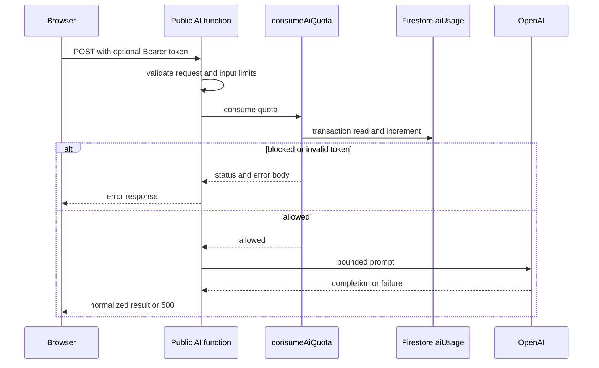

# 범위와 목적

`openaiChatCompletions`와 `translateFlashcards`는 랜딩 데모도 호출해야 하므로 CORS를 허용하고 `invoker: "public"`인 HTTP 함수다. 프런트엔드는 프로덕션에서 환경 변수로 정한 Functions 기본 URL에 함수 이름을 붙여 호출하고, 그 URL은 빌드 산출물에 포함된다. 따라서 URL을 비공개 정보처럼 취급하거나 주소를 숨겨 모델 호출을 막는 방식은 성립하지 않는다.

이 경계의 보호 수단은 `functions/src/ai-guard.ts`의 `consumeAiQuota`다. 모델 요청 전에 서버가 소유하는 일일 카운터를 원자적으로 차감하고, 호출자는 인증 상태에 따라 다른 버킷을 사용한다. 이는 공개 엔드포인트를 없애는 장치가 아니라 공개 상태를 전제로 호출량과 입력량을 제한하는 장치다.

질문 재생성의 `regenerateCardQuestion`도 공개 HTTP 함수지만 이 공용 guard의 대상은 아니다. 해당 함수는 `regenerateCounts`와 `demoRegenerateCounts`로 별도의 인증·기기 식별자 기반 정책을 구현한다. 따라서 이 문서의 한도나 실패 차감 규칙을 재생성 경로에 일반화해서는 안 된다.



*공개 호출부터 검증, 한도 차감, 모델 호출과 응답까지의 순서이며, 모델 호출 전 통과한 요청은 이미 차감되어 있다.*

## 호출자 구분과 일 경계

| 호출 상태 | 식별 키 | 일일 한도 | 추가 제한 |
| --- | --- | ---: | --- |
| 유효한 Firebase ID 토큰이 있는 Free 사용자 | 검증된 `uid` | 100 | 없음 |
| 유효한 Firebase ID 토큰이 있는 Pro 사용자 | 검증된 `uid` | 300 | 없음 |
| Authorization 헤더가 없는 데모 호출 | `X-Forwarded-For` 첫 값 또는 `req.ip`의 SHA-256 앞 32자 | 30 | 모든 비로그인 호출이 공유하는 500회 상한 |

`Authorization`이 `Bearer `로 시작하면 guard는 익명으로 되돌아가지 않고 ID 토큰을 검증한다. 검증 실패는 `401`과 `UNAUTHENTICATED`로 끝나며 카운터를 차감하지 않는다. 토큰이 없을 때만 익명 정책을 적용한다. 앱 API 클라이언트도 로그인 상태라면 ID 토큰을 헤더에 실어, 로그인 호출이 데모 버킷을 소모하지 않게 한다.

날짜 키는 현재 시각에 9시간을 더한 뒤 ISO 날짜 부분을 취한 `YYYY-MM-DD`이며, 즉 KST 자정에 일일 집계가 바뀐다. 각 문서는 `date`, `count`, `updatedAt`을 저장하며 문서의 날짜가 오늘과 다르면 기존 `count`는 0으로 간주한다. 별도 정리 작업 없이 다음 번 차감에서 새 날짜와 카운트로 덮어쓴다.

## 왜 익명 한도가 두 개인가

IP별 문서 ID에는 원본 IP 대신 해시만 저장한다. 그러나 `X-Forwarded-For`는 호출자가 채울 수 있으므로 IP별 30회 제한만으로는 헤더 값을 바꿔 우회할 수 있다. 익명 차감은 같은 Firestore 트랜잭션 안에서 호출자 문서와 `anonGlobal` 문서를 함께 읽고 둘 다 증가시킨다. 전역 카운터가 먼저 500에 도달했는지 검사한 뒤 호출자 한도를 검사하므로, IP를 바꾼 요청도 공유 상한을 넘으면 `429`, `DEMO_BUDGET_EXCEEDED`가 된다.

반대로 로그인 호출에는 이 익명 전역 상한을 적용하지 않는다. 익명 트래픽이 전역 몫을 모두 써도 로그인 사용자의 카드 생성이 함께 중단되지 않게 하는 분리다. 더 강한 요청 출처 증명이 필요하면 이 코드만으로는 충분하지 않으며, App Check를 도입하려면 Firebase 콘솔의 reCAPTCHA 등록과 enforcement 설정을 함께 운영해야 한다.

## 카운터 소유권과 원자성

카운터는 `users/{uid}`가 아니라 `aiUsage` 컬렉션에 있다. Firestore 규칙은 이 컬렉션에 클라이언트용 `match` 규칙을 두지 않아 기본 거부이며, Cloud Functions의 Admin SDK만 접근한다. 사용자가 쓸 수 있고 삭제도 가능한 사용자 문서에 사용량을 저장하면 문서 삭제·재생성으로 한도를 초기화할 수 있기 때문이다. 이 저장소 경계의 상세는 [Firestore 데이터 경계](firestore-data-boundary.md)에서 다룬다.

- 로그인 호출은 `user__${uid}` 문서를 트랜잭션으로 읽고, 오늘의 카운트가 등급 한도 미만일 때만 1 증가시킨다.
- 익명 호출은 `anon__${ipHash}`와 `anonGlobal`을 **한 트랜잭션**에서 읽고 쓴다. 읽기와 쓰기를 분리하면 동시 요청이 같은 잔여 횟수를 보고 상한 이상으로 통과할 수 있다.
- 한도에 막힌 요청은 `429`를 돌려주고 카운터를 바꾸지 않는다. 일반 한도 오류는 `LIMIT_EXCEEDED`와 적용 한도를 담는다.

# 입력 크기 경계

호출 횟수 제한은 요청 하나가 매우 큰 프롬프트가 되는 문제를 해결하지 않는다. 두 공개 함수는 모델 호출 전에 다음 입력 경계를 적용한다.

| 경로 | 제한 | 처리 |
| --- | --- | --- |
| 카드 생성 `openaiChatCompletions` | `MAX_FLASHCARD_PROMPT_CHARS` 30,000자 | 공용 `requestFlashcardCompletion`이 본문을 앞부분으로 자르고 경고를 남긴 뒤 호출한다. 큰 커밋을 이유로 정상 흐름 전체를 거부하지 않는다. |
| 카드 번역 `translateFlashcards` | `MAX_TRANSLATE_CARDS` 200장 | 초과 시 모델 호출·쿼터 차감 전에 `413 PAYLOAD_TOO_LARGE`로 거부한다. |
| 카드 번역 `translateFlashcards` | `MAX_TRANSLATE_PROMPT_CHARS` 120,000자 | 질문·답변 쌍을 JSON 문자열로 만든 길이가 초과하면 같은 `413`으로 거부한다. |

번역은 결과 배열을 원본 카드 인덱스에 맞춰 다시 붙인다. 입력을 임의로 잘라 카드 수가 달라지면 이 대응이 깨질 수 있으므로, 생성 경로와 달리 잘라서 계속하지 않는다. 번역 결과 수가 실제 카드 수와 달라도 함수는 경고를 남기고 없는 항목에는 원본 질문·답변을 유지한다.

# 차감 순서와 실패 의미

입력 검증의 위치가 비용 경계의 일부다.

1. `openaiChatCompletions`는 API 키 설정과 `text` 존재를 확인한 뒤 quota를 차감하고, 공용 생성 함수가 프롬프트를 자른 뒤 모델을 호출한다.
2. `translateFlashcards`는 HTTP 메서드, 요청 구조, 카드 수, 직렬화한 본문 길이를 먼저 확인한 뒤 quota를 차감하고 모델을 호출한다.
3. guard가 허용을 반환하는 시점에는 Firestore 트랜잭션의 증가가 이미 완료되어 있다. 그 뒤 모델이 오류를 반환하거나, 네트워크 오류·응답 JSON 파싱 오류가 나도 차감은 되돌리지 않는다.

이 선차감은 동일한 허용량을 여러 동시 요청이 소비하는 일을 막는 대신, 모델 실패가 사용자 관점에서는 성공 결과 없이 한도를 소비할 수 있음을 뜻한다. 재시도나 환불 동작을 추가하려면 단순 감소 연산을 오류 처리기에 붙이지 말고, 요청 식별자와 최종 상태를 포함하는 별도 예약·확정 설계를 도입해야 한다. 그렇지 않으면 중복 실패 처리나 재시도로 다시 상한을 우회할 수 있다.

응답도 호출자가 관찰하는 계약이다. guard의 인증 실패·한도 초과는 각각 `401`·`429`와 구조화된 오류 본문을 그대로 반환한다. 번역 함수는 모델 비정상 응답의 상태 코드만 오류 메시지에 담지만, 카드 생성 함수의 `OpenAIRequestError` 처리기는 모델 오류 본문을 500 응답에 포함한다. 외부 공급자 오류 본문을 클라이언트에 노출하지 않는 정책으로 바꾸려면 이 두 경로를 함께 검토해야 한다.

# 변경 및 운영 점검

- 공개 함수 이름이나 호출 URL을 바꾸면 앱의 `openaiApi.ts`와 `translateApi.ts`가 조합하는 URL, 그리고 개발 서버의 `/api` 프록시를 함께 확인한다. 프로덕션 URL은 빌드 시 환경 변수에서 인라인되며, 로컬 개발은 `/api`를 Functions Emulator 대상으로 다시 쓴다.
- 등급 판정은 `users/{uid}.subscriptionTier === "pro"`만 Pro로 보고 그 외는 Free로 취급한다. 한도나 등급을 바꿀 때는 서버가 신뢰하는 이 필드의 쓰기 권한도 [Firestore 데이터 경계](firestore-data-boundary.md)와 함께 검토한다.
- `aiUsage`의 문서 ID 접두사와 `anonGlobal`은 정책 상태의 일부다. 이름을 바꾸거나 사용자 문서로 옮기면 기존 사용량 연속성과 클라이언트 비쓰기 불변식을 명시적으로 이전해야 한다.
- Functions는 배포 전에 TypeScript를 빌드한다. 변경 후 최소한 다음을 실행하고, Emulator에서 유효 토큰·없는 토큰·잘못된 Bearer 토큰, 각 413 입력, 한도 도달, 모델 실패 뒤 재호출을 확인한다.

```bash
pnpm --prefix functions run lint
pnpm --prefix functions run build
```

카드 생성의 공용 모델 호출 및 사전 생성 경로와의 관계는 [카드 생성 경로](../flashcard/generation-paths.md)에서 확인할 수 있다.
