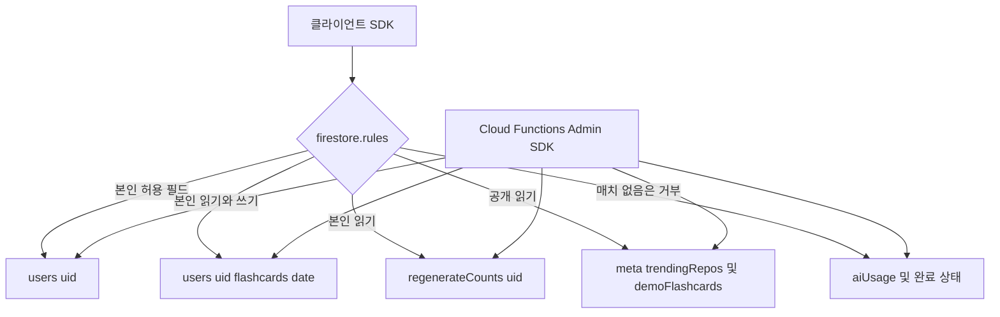

`firestore.rules`는 클라이언트 SDK가 소유할 데이터와 Cloud Functions의 Admin SDK가 관리할 상태를 구분한다. 핵심 원칙은 **클라이언트가 삭제할 수 있는 `users/{uid}`에 한도·완료 상태처럼 삭제로 초기화되어서는 안 되는 값을 두지 않는 것**이다. Admin SDK는 Firestore 보안 규칙을 우회하므로, 규칙에 클라이언트 `match` 허용을 추가하지 않은 컬렉션이 서버 전용 저장소가 된다.

클라이언트 요청은 규칙으로 제한되고, 서버 작업은 Admin SDK로 같은 저장소의 서버 전용 상태까지 관리하는 경계를 보여 준다.

## 소유권별 데이터 모델

| 영역 | 경로와 접근 | 책임과 수명 |
|---|---|---|
| 사용자 프로필·설정 | `users/{uid}`: 인증된 본인만 읽고 생성·갱신·삭제 | 저장소 선택, 온보딩, GitHub 접근 토큰, 푸시 선호와 사전 생성에 필요한 시간대·언어를 담는다. 구독 필드는 같은 문서에 있어도 서버가 소유한다. |
| 사용자 덱 | `users/{uid}/flashcards/{YYYY-MM-DD}`: 본인 읽기·쓰기 | 앱이 생성·번역·카드 편집 결과를 저장하고, 서버 사전 생성도 같은 날짜 문서에 병합한다. 설정 저장과 탈퇴는 클라이언트가 이 하위 컬렉션을 삭제한다. |
| 표시 전용 서버 카운터 | `regenerateCounts/{uid}`: 본인 읽기만 | 질문 재생성의 남은 횟수 표시에만 공개한다. 실제 쓰기는 HTTP 함수가 수행한다. |
| 공개 캐시 | `meta/trendingRepos`, `demoFlashcards/{cacheId}`: 비로그인도 읽기 가능, 클라이언트 쓰기 불가 | 랜딩 페이지가 읽는 Trending 목록과 사전 생성 데모 카드다. 스케줄러가 갱신·정리한다. |
| 서버 전용 상태 | `aiUsage`, `demoRegenerateCounts`, `flashcardPregeneration` | 규칙에 `match`가 없어 클라이언트 읽기·쓰기가 기본 거부된다. 호출 비용 한도와 사전 생성 완료 여부를 서버만 관리한다. |
| 탈퇴 당일 기록 | `deletedUsers/{uid}`: 본인 읽기·생성만 | 클라이언트가 탈퇴 전에 기록하고, 서버 정리 작업이 당일 기록만 남긴다. 이 경로에는 클라이언트 삭제 허용이 없다. |

`notices/{noticeId}`는 인증 사용자에게 읽기만 허용한다. 반면 현재 설정 화면은 `config/notice`를 구독하는데, 이 경로에는 규칙 `match`가 없으므로 클라이언트 읽기는 기본 거부다. `notices` 규칙이 `config/notice`까지 포괄한다고 가정하지 말고, 공지 경로를 맞추거나 별도의 읽기 정책을 설계해야 한다.

## `users/{uid}`: 허용 목록과 필드 검증

문서 ID와 Firebase Auth UID가 같을 때만 접근할 수 있다. 생성은 문서의 **모든** 키가 허용 목록 안에 있어야 하고, 갱신은 `request.resource.data.diff(resource.data).affectedKeys()`가 허용 목록 안에 있어야 한다. 따라서 서버가 추가한 `subscriptionTier`, `subscriptionPeriodEnd`, `stripeCustomerId`가 기존 문서에 있어도 클라이언트가 다른 설정을 변경할 수 있지만, 해당 필드를 추가·수정·삭제하려 하면 거부된다.

클라이언트 허용 필드는 `repositories`, 온보딩 플래그, `githubToken`, 푸시 설정과 FCM 토큰, `timezone`, `language`, `updatedAt`이다. 규칙은 다음을 함께 검사한다.

- `repositories`는 최대 5개이며 각 항목은 `fullName`과 HTTPS `url`을 반드시 포함하고, 선택 `branch` 외의 키를 가질 수 없다. 문자열 길이도 제한한다.
- 불리언 플래그, 토큰과 시간대 문자열 길이, `language`의 `ko`/`en`, 푸시 시각의 0–23 범위를 검사한다. `preferredPushHour`는 과거 번들 호환성을 위해 정수보다 넓은 `number`를 허용한다.
- `updatedAt`은 길이 제한이 있는 문자열 또는 Firestore `timestamp`를 받는다. PWA 서비스 워커 캐시에 남은 과거 번들이 `Date`를 그대로 기록할 수 있으므로, 타입을 한 번에 문자열로 좁히면 배포 뒤에도 실행되는 구버전 클라이언트의 설정 저장이 실패한다.

설정 화면은 `setDoc(..., { merge: true })` 또는 필드 `updateDoc`로 자신이 소유한 필드만 쓴다. 문서 전체를 덮어쓰면 규칙이 서버 필드 변경으로 판단해 거부할 뿐 아니라, 서버 필드 보존이라는 의도도 흐려진다. 로그인도 새 문서에는 GitHub 토큰과 `updatedAt`만 만들고, 기존 문서에서는 그 두 필드만 갱신한다. 구독 변경은 Stripe 웹훅이 Admin SDK의 병합 쓰기로 수행하며, 클라이언트는 구독 상태를 읽어서 UI와 한도를 선택한다.

## 삭제와 초기화되지 않아야 하는 상태

본인 `users/{uid}` 삭제는 회원 탈퇴를 위해 의도적으로 허용된다. 이 작업은 문서의 서버 소유 구독 필드까지 제거할 수 있다. 그러므로 다음 상태를 `users`에 새로 넣어 "클라이언트 쓰기만 막으면 안전하다"고 판단하면 안 된다.

- AI 호출 한도는 `aiUsage`에 둔다. 인증 호출은 UID별 문서에서, 비로그인 호출은 IP 해시별 문서와 공용 문서에서 트랜잭션으로 일일 카운터를 먼저 차감한다. 사용자 문서 삭제나 재생성으로 이 비용 경계가 리셋되지 않는다. 자세한 호출 순서는 [AI 호출 경계](ai-call-guard.md)를 따른다.
- 질문 재생성 한도는 `regenerateCounts/{uid}`에 둔다. 본인은 읽기만 가능하고 `regenerateCardQuestion`이 성공한 모델 응답 뒤 카운터를 기록한다. UI의 실시간 구독은 버튼 표시용이며, 최종 429 판정은 서버 함수가 한다.
- 사전 생성 완료 여부는 `flashcardPregeneration/{uid}`에 별도 기록한다. 덱 문서가 없는 경우를 "커밋 없음"과 "아직 처리 안 됨"으로 구분해야 하며, 완료 기록은 `saved`, `exists`, `empty`, `unavailable` 결과와 날짜를 보관한다. 사용자 덱 삭제와 독립적이므로 삭제가 완료 기록을 되살리거나 초기화하지 않는다.
- 비로그인 재생성의 기기 식별자 해시 카운터도 `demoRegenerateCounts`에 둔다.

서버 전용 상태의 불변식은 **클라이언트가 읽거나 쓰거나 삭제할 수 없어야 하며, 특히 `users/{uid}`의 삭제로 일일 사용량 또는 서버 작업 완료 상태가 초기화되어서는 안 된다**이다. 신규 서버 전용 컬렉션에는 편의상 본인 `match`를 추가하지 말고, 표시가 필요할 때만 `regenerateCounts`처럼 최소한의 읽기 전용 투영을 따로 설계한다.

## 사전 생성과 공개 캐시의 쓰기 주체

사용자 덱은 공유 경로지만 서로 다른 쓰기 주체가 충돌할 수 있다. `scheduleFlashcardPregeneration`은 사용자의 `timezone`, `language`, `repositories`를 읽어 대상 태스크를 만들고, 작업 함수는 이미 덱이 있으면 건너뛴다. 새 덱 저장도 트랜잭션에서 다시 존재 여부를 확인한 뒤 언어 필드만 병합한다. 앱이 먼저 만든 덱을 서버가 덮어쓰지 않도록 하는 순서다. 배경과 재시도 정책은 [플래시카드 사전 생성](../flashcard/pregeneration.md), 덱 크기 제한은 [덱 크기 예산](../flashcard/deck-size-budget.md)을 참고한다.

반대로 공개 캐시는 클라이언트가 수정할 이유가 없다. `refreshTrendingRepos`가 유효한 수의 Trending 결과일 때만 `meta/trendingRepos`를 교체하고, 데모 카드 사전 생성과 오래된 캐시 삭제를 뒤이어 수행한다. 랜딩은 읽기 실패 또는 캐시 부재 시 대체 경로로 진행한다. 공개 읽기는 데이터 공개 범위이기도 하므로, 개인 저장소 정보·토큰·사용자별 덱을 이 컬렉션에 추가하지 않는다.

## 안전한 스키마 변경 절차

1. **소유자와 삭제 의미부터 정한다.** 새 필드가 사용자 설정이면 `users` 허용 목록과 타입 검증을 함께 바꾸고, 삭제되어도 되는지 확인한다. 사용량·결제 권한·중복 방지·작업 완료 상태면 서버 전용 컬렉션으로 분리한다.
2. **생성, 갱신, 삭제를 각각 검토한다.** 새 클라이언트 필드는 `create`의 `keys().hasOnly`, `update`의 `affectedKeys`, `isValidUserData` 세 곳을 모두 통과해야 한다. 서버 전용 필드는 클라이언트 갱신에서 영향을 받지 않아야 하고, 사용자 문서 삭제 후에도 유지되어야 하는지 결정한다.
3. **롤링 배포를 허용한다.** 캐시된 PWA 번들과 새 규칙은 동시에 배포되지 않는다. 기존 유효 표현을 갑자기 금지하지 말고, `updatedAt`처럼 구·신 형식을 제한적으로 함께 받거나 읽기 경로에서 호환한 뒤 충분한 전환 기간 후 정리한다.
4. **서버와 클라이언트의 쓰기 단위를 맞춘다.** 서버가 같은 `users` 문서에 병합하는 필드가 있으면 클라이언트도 필드 병합을 사용한다. 사용자 덱처럼 경쟁 가능한 문서는 존재 검사와 저장을 트랜잭션으로 묶어야 한다.
5. **규칙을 데이터 계약으로 검증한다.** 최소한 타인 UID 접근, 허용되지 않은 키의 생성·갱신·삭제, 잘못된 저장소 항목과 경계값, 서버 필드를 가진 기존 문서의 정상 설정 갱신, 사용자 문서 삭제 후 서버 카운터 보존을 에뮬레이터 규칙 테스트로 확인한다.

Firebase 초기화는 클라이언트에서 `getFirestore(app)`만 생성하며 IndexedDB 오프라인 지속성을 명시적으로 켜지 않는다. 여기서 말하는 PWA 호환성은 Firestore 로컬 영속화 설정이 아니라, 서비스 워커가 보존한 이전 JavaScript 번들이 새 규칙과 공존할 수 있다는 배포 호환성 제약이다. GitHub 접근 범위와 토큰의 사용 경로는 [GitHub 접근](../integrations/github-access.md), 푸시 필드의 서버 소비 방식은 [푸시 알림 운영](../operations/push-notifications.md)을 함께 확인한다.
