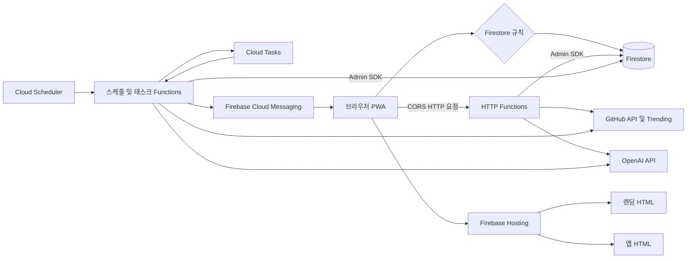

# 시스템 구성

CodeRecall은 정적 브라우저 번들(`app`)과 별도 Node.js Functions 번들(`functions`)을 Firebase에 배포한다. 브라우저는 본인 데이터와 공개 캐시를 Firestore 클라이언트 SDK로 읽고 쓸 수 있지만, 외부 API 자격 증명·사용량·백그라운드 완료 상태처럼 클라이언트가 신뢰할 수 없는 일은 HTTP Functions 또는 스케줄 작업의 Admin SDK가 맡는다. 즉, Functions는 단순한 API 프록시가 아니라 **권한 확인, 비용 제어, 외부 연동, 서버 전용 상태 변경**의 경계다.

*브라우저의 규칙 적용 SDK 경로와 Functions의 Admin SDK 경로, 그리고 정기 작업이 외부 서비스와 만나는 지점을 나타낸다.*

## 브라우저 진입점과 Hosting 라우팅

Vite는 `index.html`의 `landing-main.tsx`와 `app.html`의 `main.tsx`를 서로 다른 입력으로 빌드한다. 전자는 랜딩 페이지, React Query, 랜딩 분석을 초기화하고, 후자는 인증 앱과 푸시 서비스 워커를 초기화한다. PWA manifest의 시작 경로도 `/app`이므로 설치형 앱과 랜딩의 진입 의도가 분리되어 있다.

Firebase Hosting의 배포 대상은 `app/dist`다. `/app` 및 `/app/**`만 `app.html`로 rewrite하며, `/terms`와 `/privacy`는 각각의 정적 HTML로 보낸다. 따라서 랜딩의 `/`은 별도 SPA fallback이 아니라 Vite가 만든 랜딩 문서를 그대로 제공한다. 라우트나 진입점을 추가할 때는 Vite의 Rollup 입력, 산출 HTML, Hosting rewrite 및 PWA의 `navigateFallback`이 같은 URL 계약을 유지하는지 함께 검토해야 한다.

개발 중 `/api`는 모드별 `VITE_FUNCTIONS_URL_LOCAL` 또는 `VITE_FUNCTIONS_URL_PROD`로 프록시되고 접두사는 제거된다. 프로덕션 호출 주소를 바꾸거나 Functions 이름을 바꾸면 브라우저 API 클라이언트와 이 프록시 계약을 함께 갱신해야 한다.

## 배포 단위와 데이터 권한 경계

`firebase.json`은 Hosting, Firestore 규칙, Functions를 한 Firebase 프로젝트 설정으로 묶지만, Functions는 `functions` 코드베이스를 TypeScript로 별도 빌드한 뒤 배포한다. Functions 런타임은 Node.js 22이며 `index.ts`가 Admin 앱을 초기화하고 각 HTTP·스케줄·태스크 트리거를 export한다. 전역 `maxInstances: 10`은 모든 함수에 적용되는 컨테이너 상한이다.

브라우저의 Firestore SDK는 규칙을 통과해야 한다. 본인 `users/{uid}` 및 덱은 사용자 소유 데이터이고, 랜딩에 필요한 `meta/trendingRepos`와 `demoFlashcards`는 공개 읽기 캐시다. 반면 `aiUsage`, `flashcardPregeneration` 등은 클라이언트용 규칙이 없어 기본 거부되며, Admin SDK가 이들을 읽고 쓴다. Admin SDK는 규칙을 우회하므로 서버 코드에서 UID, 입력, 쓰기 대상을 명시적으로 검증하지 않고 클라이언트 규칙에만 의존해서는 안 된다. 컬렉션별 계약은 [Firestore 데이터 경계](firestore-data-boundary.md)를 따른다.

HTTP Functions 중 일부는 CORS preflight와 랜딩 데모를 위해 `invoker: "public"`이다. 이것은 누구나 URL에 도달할 수 있다는 뜻이지 개인 데이터 접근을 허용한다는 뜻이 아니다. GitHub 경로는 Firebase ID 토큰을 Admin Auth로 검증한 뒤 해당 사용자의 `users/{uid}` 설정에서 저장소와 GitHub 토큰을 읽는다. 공개 AI 경로는 모델 호출 전에 서버 전용 Firestore 카운터를 트랜잭션으로 차감한다. 공개 URL을 숨기는 대신 인증·입력 검증·한도를 서버에서 강제하는 이유와 세부 한도는 [공개 AI 함수 호출 경계](ai-call-guard.md)를 참고한다.

## 외부 서비스의 책임

| 외부 서비스 | Functions가 맡는 일 | 브라우저가 직접 맡지 않는 이유 |
| --- | --- | --- |
| GitHub API | ID 토큰으로 사용자 설정을 확인한 뒤, 사용자 GitHub 토큰으로 커밋·파일·저장소 정보를 조회한다. 매일 Trending HTML도 서버에서 수집한다. | 개인 토큰을 요청마다 노출하지 않고, Trending은 브라우저 CORS로 직접 읽을 수 없다. |
| OpenAI API | 카드 생성·번역·재생성 및 사전 생성에 모델을 호출한다. 공개 호출은 서버 전용 사용량 계수와 입력 경계를 거친다. | API 키와 비용 한도, 모델 입력 정책을 신뢰할 수 있는 서버에 둔다. |
| Firebase Cloud Messaging | 정기 작업이 조건에 맞는 FCM 토큰을 묶어 리마인더를 전송한다. 앱은 서비스 워커를 등록해 수신 기반을 만든다. | 전송 권한과 전체 사용자 토큰 조회는 클라이언트에 둘 수 없다. |

랜딩의 Trending은 외부 GitHub를 실시간으로 조회하지 않고 Firestore 공개 캐시를 읽는다. `refreshTrendingRepos`는 하루 한 번 상위 10개를 파싱하되 5개 미만이면 이전 캐시를 보존한다. 목록 저장 뒤 데모 카드 사전 생성 또는 오래된 카드 정리가 실패해도 이미 저장한 목록 캐시는 유지된다. 이 분리는 랜딩 가용성을 외부 HTML 구조 및 모델 호출 실패와 분리한다.

## 정기 작업과 사전 생성 수명

| 작업 | 시간·리전 | 책임과 실패 의미 |
| --- | --- | --- |
| `sendDaily8amPush` | 매시 정각, `asia-northeast3` | `pushEnabled` 사용자를 읽고 각 사용자의 시간대 현지 시가 선호 시각과 같을 때 FCM을 보낸다. 토큰은 500개씩 전송하며, 전체 작업 오류는 로그로 남긴다. |
| `scheduleFlashcardPregeneration` | 매시 정각, `asia-northeast3` | 사용자 현지 0시부터 6시 사이의 최근 활동 사용자만 골라 Cloud Tasks에 사용자별 덱 생성 작업을 넣는다. 등록 실패가 하나라도 있으면 스케줄러 재시도를 위해 예외를 던진다. |
| `pregenerateUserFlashcards` | 태스크 큐, `asia-northeast3` | GitHub 커밋과 OpenAI 생성 결과로 날짜별 사용자 덱을 저장한다. 최대 동시 디스패치는 5이며 최대 3회 시도한다. |
| `refreshTrendingRepos` | 매일 09:00 KST, `asia-northeast3` | GitHub Trending 캐시와 랜딩 데모 카드를 갱신한다. 실행 제한은 540초, 메모리는 512MiB다. |
| `cleanupDeletedUsers` | 매일 12:00 KST, `asia-northeast3` | `deletedUsers`에서 KST 기준 당일 기록만 남기고 이전 기록을 배치 삭제한다. |

시간대별 작업은 Scheduler의 기준 시간대만으로 사용자 현지 시간을 표현하지 않는다. 푸시와 덱 사전 생성 모두 매시 실행한 뒤 `Intl` 기반 사용자 IANA 시간대에서 시각과 날짜를 계산한다. 이 때문에 모든 시간대를 하루 24회로 훑을 수 있으며, 잘못된 시간대 값은 사전 생성 대상에서 제외된다.

사전 생성은 스케줄러가 모델 작업을 직접 수행하지 않도록 두 단계로 분리한다. 스케줄러는 후보 선정·완료 기록 조회·큐 등록만 하고, 태스크가 한 사용자의 저장소와 복습 날짜를 처리한다. 완료 기록은 서버 전용 `flashcardPregeneration`에 날짜와 결과를 남기며, 같은 시각의 재등록은 `uid-날짜-시` 태스크 ID로 중복을 막는다. 덱이 이미 있으면 건너뛰고, 저장 시에도 트랜잭션에서 다시 확인해 자정 직후 앱이 먼저 저장한 덱을 덮어쓰지 않는다. 일시 실패는 완료로 기록하지 않아 태스크 재시도 또는 새벽 다음 시각에 다시 시도할 수 있다. 전체 흐름은 [플래시카드 생성 경로](../flashcard/generation-paths.md)와 [사전 생성](../flashcard/pregeneration.md)을 참고한다.

## 변경 시 영향 범위와 검증

- **리전 변경:** HTTP 함수, Scheduler, 태스크 큐 경로가 모두 `asia-northeast3`를 전제로 한다. 특히 사전 생성 큐 이름에는 `locations/${REGION}/functions/pregenerateUserFlashcards`가 들어가므로, 트리거만 다른 리전으로 옮기면 큐 연결이 끊어진다. 브라우저가 리전 포함 Functions URL을 구성한다면 환경 변수도 함께 확인한다.
- **동시성·용량 변경:** 전역 `maxInstances: 10`과 태스크의 `maxConcurrentDispatches: 5`는 별개 제약이다. 후자는 한 태스크가 최대 15개의 AI 호출을 병렬화하는 전제에서 OpenAI 속도 제한을 보호한다. 값을 높이면 생성 지연은 줄 수 있지만 모델 호출량, Firestore 부하 및 전역 컨테이너 상한과 함께 평가해야 한다.
- **규칙 또는 컬렉션 변경:** 공개 읽기 캐시에 개인 데이터나 토큰을 넣지 말고, 비용·중복 방지·완료 상태는 클라이언트가 삭제 가능한 사용자 문서가 아닌 서버 전용 컬렉션에 둔다. Admin SDK 쓰기는 규칙 테스트만으로 보장되지 않으므로 함수의 인증과 소유권 검증도 확인한다.
- **대표 검증:** 이 저장소에는 앱 또는 Functions의 전용 테스트 파일이 없다. 변경 전후에는 `pnpm --filter app build`, `pnpm --filter functions build`로 두 빌드 단위를 각각 확인하고, Hosting rewrite와 `/api` 프록시, 공개 캐시의 비로그인 읽기, ID 토큰이 필요한 GitHub 호출, 스케줄러의 재시도·중복 덱 방지 경로를 Emulator 또는 배포 환경에서 점검한다.
