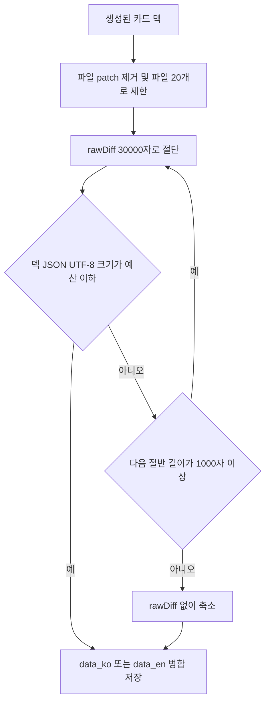

`users/{uid}/flashcards/{YYYY-MM-DD}` 한 문서에는 언어별 배열 `data_ko`, `data_en`가 함께 저장된다. Firestore 문서가 1 MiB(1,048,576 bytes)를 넘으면 쓰기가 거부되며, 큰 커밋의 원문 diff는 여러 카드에 반복되어 문서 크기를 빠르게 키운다. 따라서 덱은 **저장 직전**에 보수적인 문서 예산 안으로 축소한다. 이 경로의 소유권과 클라이언트 쓰기 권한은 [Firestore 데이터 경계](../architecture/firestore-data-boundary.md)를 참고한다.

## 예산과 측정 기준

| 항목 | 값 | 의미 |
|---|---:|---|
| Firestore 문서 상한 | 1,048,576 bytes | 넘으면 문서 쓰기가 거부되는 상한 |
| `MAX_FLASHCARD_DOC_BYTES` | 900,000 bytes | 필드명 등을 고려한 안전 상한 |
| `FLASHCARD_DECK_BUDGET_BYTES` | 450,000 bytes | 두 언어 필드가 같은 문서 예산을 공유하므로 언어별 기본 절반 |
| `MAX_RAW_DIFF_CHARS` | 30,000자 | 카드에 남길 `rawDiff`의 최초 상한이며 생성 프롬프트의 diff 상한과 동일 |
| `MIN_RAW_DIFF_CHARS` | 1,000자 | 이보다 짧게 해야 하면 `rawDiff`를 저장하지 않는 경계 |
| `MAX_FILES_PER_CARD` | 20개 | 파일 보기 탭에 남길 파일 메타데이터 상한 |

앱은 `TextEncoder().encode(JSON.stringify(deck)).length`, 서버는 `Buffer.byteLength(JSON.stringify(deck), "utf8")`로 덱 배열의 UTF-8 직렬화 크기를 잰다. 이는 Firestore의 정확한 저장 크기 계산식은 아니지만 JSON의 따옴표와 이스케이프까지 포함하는 보수적 근사치다. 예산은 카드 수를 제한하는 규칙이 아니라 저장 표현의 바이트 크기 제한이다.



저장 직전에 중복 데이터를 먼저 제거하고, 남은 원문 diff만 단계적으로 줄이는 흐름이다.

## 축소 순서와 보존되는 정보

`fitFlashcardDeckToBudget`은 각 후보 길이에 대해 모든 카드를 축소하고 크기를 재서, 예산에 처음 들어오는 표현을 선택한다.

1. 각 카드의 `metadata.files[].patch`를 항상 제거한다. 같은 변경 내용이 `rawDiff`에 이미 있어 중복이며, 파일 보기 탭은 `filename`, `raw_url` 등의 남은 메타데이터로 원본 파일을 다시 가져올 수 있다.
2. `files`는 앞의 20개만 남긴다.
3. `rawDiff`는 30,000자부터 시작하여 `30,000 → 15,000 → 7,500 ...`처럼 절반씩 줄인다. 질문·답변·하이라이트와 커밋/저장소/브랜치 메타데이터는 이 단계에서 유지한다.
4. 1,000자 이상인 모든 후보도 예산을 넘으면 `rawDiff` 자체를 뺀 표현을 반환한다. 질문 재생성에는 원문 diff가 필요하므로 이런 카드에서는 재생성 UI가 숨겨진다.

원문 diff는 설명 가능성과 문서 크기 사이의 의도적인 trade-off다. `patch`를 없애도 `rawDiff`가 남아 있으면 카드 뒷면의 Diff 보기는 유지된다. 반대로 최종 단계에서 diff를 없애면 저장 실패는 피하지만, 해당 카드는 질문·답변과 비-diff 메타데이터만 가진다. 따라서 이 알고리즘은 카드 자체를 임의로 삭제하는 대신, 먼저 중복 표현과 원문 세부도를 희생한다.

### Markdown 안전 절단

`rawDiff`는 Markdown이며 보통 ` ```diff ` 코드 펜스를 포함한다. 단순 문자열 절단 지점까지의 펜스 개수가 홀수이면 절단 결과에 닫는 ` ``` `를 추가한 뒤 `…(truncated)`를 붙인다. 렌더러가 이후 본문까지 코드 블록으로 해석하는 문제를 막는 대신, 마지막 hunk나 코드 줄은 불완전할 수 있다. 이 표시는 원문 전체가 아니라 저장 예산 때문에 잘린 미리보기임을 명시한다.

## 앱 쓰기 경로의 남은 예산

앱의 `useTodayFlashcards`는 오늘 문서에서 현재 언어 덱을 먼저 읽는다. 현재 언어 덱이 없고 반대 언어 덱이 있으면 번역 결과를 저장하기 전에 다음 중 작은 값을 번역 덱의 예산으로 쓴다.

```ts
Math.min(
  FLASHCARD_DECK_BUDGET_BYTES,
  MAX_FLASHCARD_DOC_BYTES - measureFlashcardDeckBytes(otherDeck)
)
```

이 계산은 예산 도입 이전의 큰 반대 언어 덱이 남아 있는 경우에도 두 배열의 합이 안전 상한을 넘지 않게 하려는 호환 처리다. 두 덱이 모두 없어서 새로 생성하는 경우에는 기본 언어별 예산으로 축소 후 `setDoc(..., { merge: true })`로 해당 `data_{lang}` 필드만 쓴다. 생성 경로 전체와 언어 전환의 관계는 [카드 생성 경로](generation-paths.md)를 참고한다.

## 서버 사전 생성과 동시성

서버 사전 생성은 카드 생성 결과를 같은 `fitFlashcardDeckToBudget` 규칙으로 축소한 뒤 `data_{language}`를 트랜잭션 병합 저장한다. 저장 전과 트랜잭션 안에서 이미 덱이 존재하는지 확인하므로, 사용자가 앱에서 먼저 생성한 문서를 서버가 덮어쓰지 않는다. 서버는 어느 한 언어 덱이라도 있으면 작업을 건너뛴다. 따라서 언어별 덱을 나중에 채우는 일은 앱의 번역 경로가 담당하며, 그때 위의 남은 예산 계산이 필요하다. 스케줄링·재시도·완료 기록의 세부 사항은 [오늘의 플래시카드 사전 생성](pregeneration.md)에 있다.

## 변경 계약: 복제 구현을 함께 갱신한다

앱의 `app/src/features/flashcard/lib/deck-size.ts`와 서버의 `functions/src/flashcard-deck-size.ts`는 별도 패키지여서 이 로직을 공유하지 않고 동등한 구현을 각각 가진다. 두 구현은 다음을 함께 바꿔야 한다.

- 문서·언어별 예산, diff 최대/최소 길이, 파일 수 상한
- JSON UTF-8 측정 방식과 비교 조건
- `patch` 제거, 파일 보존 필드, `rawDiff` 생략 조건
- 코드 펜스 닫기와 `…(truncated)` 표식을 포함한 절단 형식
- 카드 및 파일 메타데이터 타입이 바뀔 때 축소 대상 필드

한쪽만 변경하면 실시간 생성과 사전 생성이 같은 날짜 문서에 서로 다른 크기·표현의 덱을 기록한다. 특히 앱에서 예산을 늘리고 서버를 그대로 두면 사전 생성 카드가 불필요하게 손실될 수 있고, 반대로 서버만 늘리면 앱이 번역 덱을 추가할 때 문서 상한을 넘길 위험이 생긴다. 상수나 축소 규칙 변경은 두 파일과 두 쓰기 경로를 하나의 변경으로 검토하고, 경계 크기·열린/닫힌 코드 펜스·diff 없는 fallback·기존 반대 언어 덱이 큰 번역 저장을 각각 검증해야 한다. 현재 이 전용 축소 모듈에 대한 테스트 파일은 없으므로, 계약 변경에는 양 구현을 같은 fixture로 비교하는 단위 테스트를 추가하는 것이 안전하다.

## 별도인 데모 캐시 예산

`demoFlashcards/{cacheId}`는 사용자 날짜 덱과 다른 문서 모델이다. 데모 사전 생성은 언어별로 문서 하나를 만들고, 커밋당 파일을 10개·각 patch를 4,000자로 제한한 뒤 문서 전체의 JSON UTF-8 크기가 900,000 bytes를 넘으면 **축소 재시도 없이 저장을 건너뛴다**. 그러므로 데모의 `MAX_DOCUMENT_BYTES = 900_000`은 같은 Firestore 상한에 대한 별도 캐시 정책이지, 위의 두 언어 `data_ko`/`data_en` 공유 예산 계약을 대체하지 않는다.
