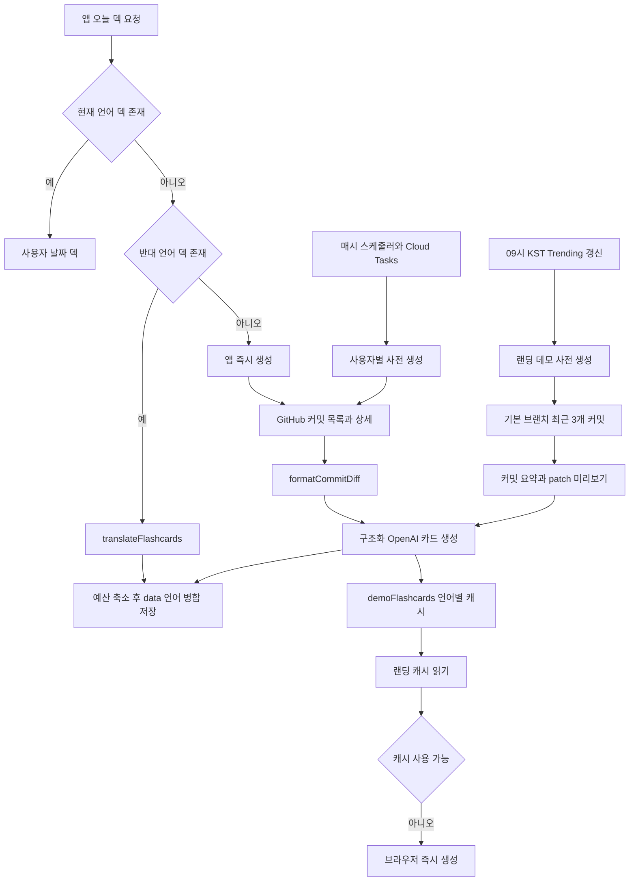
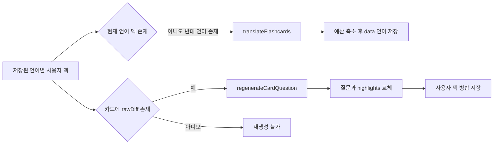

사용자 날짜 덱과 랜딩 데모는 모두 GitHub 커밋을 질문·답변 카드로 바꾸지만, **누가 언제 생성하고 어디에 보관하는지**가 다르다. 로그인 앱은 이미 저장된 언어별 덱을 우선 읽고, 없으면 반대 언어 덱을 번역하며, 그것도 없을 때만 즉시 생성한다. 서버는 같은 사용자 덱을 새벽에 미리 채울 수 있고, 랜딩은 Trending 저장소의 별도 공개 캐시를 먼저 읽는다. 데이터 소유권과 읽기 권한은 [Firestore 데이터 경계](../architecture/firestore-data-boundary.md)를 참고한다.

## 세 생성 경로와 저장소

| 경로 | 진입점과 시점 | 커밋 선택 | 저장 지점과 소비자 |
|---|---|---|---|
| 앱 즉시 생성 | `useTodayFlashcards`가 오늘 문서와 반대 언어 덱 모두 없을 때 | 선택 저장소별로 Free는 1·7일 전, Pro는 1·7·30일 전의 첫 변경 포함 커밋 | `users/{uid}/flashcards/{YYYY-MM-DD}`의 `data_ko` 또는 `data_en`; 앱이 이후 같은 언어 덱을 읽음 |
| 사용자별 사전 생성 | `scheduleFlashcardPregeneration`이 로컬 0–6시의 최근 활동 사용자를 Cloud Tasks에 넣고 `pregenerateUserFlashcards`가 처리 | 즉시 생성과 같은 저장소 × 복습 간격 및 날짜 범위 | 같은 날짜 문서의 해당 언어 필드; 앱 즉시 생성보다 먼저 준비하는 경로 |
| 랜딩 데모 캐시 | 매일 09:00 KST `refreshTrendingRepos`가 유효한 Trending 목록을 저장한 뒤 `pregenerateDemoFlashcards` 호출 | 기본 브랜치의 최근 3개 커밋 | `demoFlashcards/{owner}__{repo}__{lang}`; 비로그인 랜딩이 먼저 읽음 |



*세 경로의 공통 모델 호출과 두 Firestore 저장 지점, 그리고 앱·랜딩의 캐시 우선 분기를 보여 준다.*

### 앱 즉시 생성과 언어 우선순위

`useTodayFlashcards`는 `users/{uid}`에서 선택 저장소를 읽고, 브라우저의 IANA 시간대와 현재 표시 언어를 사용자 문서에 best-effort로 동기화한다. 이 값은 서버가 사전 생성을 할 날짜와 언어를 정하는 입력이다. 오늘 날짜 문서에서는 다음 순서가 중요하다.

1. 현재 언어 배열이 비어 있지 않으면 생성하지 않는다. 브랜치가 없는 기존 카드에는 기본 브랜치를 보강해 병합 저장할 수 있다.
2. 현재 언어가 없고 반대 언어 덱이 있으면 새 GitHub 조회나 카드 생성 대신 `translateFlashcards`를 호출한다. 번역은 질문·답변만 바꾸고 `highlights`와 `metadata`는 원본 카드에서 유지한다.
3. 두 언어 덱 모두 없을 때에만 저장소와 복습 날짜를 순차로 조회한다. 각 조합에서 파일 변경이 있는 첫 커밋의 diff를 만들고 `openaiChatCompletions`로 보낸다. 조합 하나의 오류는 로그만 남기고 다음 조합을 계속한다.
4. 카드가 하나 이상이면 덱 크기를 축소한 뒤 해당 `data_{lang}`만 `merge` 저장한다. 카드가 없거나 최상위 흐름이 실패하면 오늘 덱 없음 상태가 된다.

공개 HTTP 함수 `openaiChatCompletions`는 `text`를 검증한 뒤 호출량 제한을 차감하고 공용 생성 함수를 호출한다. 공개 함수의 한도·입력 상한·선차감 실패 의미는 [공개 AI 함수 호출 경계](../architecture/ai-call-guard.md)에 있다.

### 사용자별 사전 생성: 즉시 생성과의 경쟁

사전 생성은 앱의 첫 화면 대기를 줄이는 보완 경로이지, 별도 덱 모델이 아니다. 매시 스케줄러는 언어·유효한 시간대·저장소가 있는 사용자 가운데 최근 7일 활동했고 현지 시각이 0–6시이며 아직 그 날짜를 완료하지 않은 사용자만 태스크로 등록한다. 작업은 저장소 × 복습 날짜를 병렬로 생성하지만, 덱의 순서는 저장소, 날짜 순서를 유지한다.

작업은 먼저 오늘 문서에 어느 언어든 비어 있지 않은 덱이 있는지 확인하고, 생성 뒤에도 Firestore 트랜잭션에서 다시 확인한다. 따라서 앱이 자정 직후 먼저 저장하면 서버는 덮어쓰지 않는다. `flashcardPregeneration/{uid}`의 서버 전용 완료 기록은 `saved`, `exists`, `empty`, `unavailable`을 구분한다. GitHub 토큰 무효와 설정 누락은 `unavailable`으로 끝내지만, 일시 오류 또는 일부 실패 때문에 빈 덱이 된 경우에는 완료를 기록하지 않고 재시도한다. 스케줄·재시도·완료 기록의 세부 사항은 [오늘의 플래시카드 사전 생성](pregeneration.md)에 있다.

### 랜딩 데모 캐시와 캐시 미스

Trending 수집 결과가 5개 미만이면 목록과 카드 캐시를 갱신하지 않는다. 충분한 목록이면 먼저 `meta/trendingRepos`를 갱신하고, 데모 카드 생성 실패는 목록 갱신을 되돌리지 않는다. 저장소는 순차 처리해 OpenAI 속도 제한을 피하고, 한 저장소 안의 커밋은 병렬로 생성한다. 한국어와 영어 각각에 대해 커밋당 첫 카드 한 장만 보관한다.

데모 캐시는 파일을 최대 10개, 각 patch를 최대 4,000자로 제한하고 JSON UTF-8 크기가 900,000 bytes를 넘으면 저장하지 않는다. 이번 Trending 목록에 없는 언어별 캐시는 뒤이어 삭제한다. 랜딩은 기본 브랜치 요청일 때만 이 캐시를 조회하며, 캐시가 없거나 읽기 실패하거나 사용자가 `@branch`를 지정하면 브라우저의 `generateDemoFlashcards`로 넘어간다. 이 fallback은 GitHub Public API와 `openaiChatCompletions`를 직접 사용하고 Firestore에는 쓰지 않는다.

## 공통 생성 계약과 경로별 차이

`functions/src/flashcard-generation.ts`는 서버 즉시 생성과 두 서버 사전 생성이 공유하는 GitHub·모델 경계다. 토큰이 있으면 GitHub Bearer 인증으로, 없으면 데모 User-Agent로 공개 저장소를 읽는다. 401은 `GitHubAuthError`로 구분하며 기본 브랜치 조회만 일반 오류를 기록하고 브랜치 없이 계속한다. 커밋 목록에는 파일 diff가 없으므로 카드용 원문은 상세 조회 뒤에 구성한다.

| 단계 | 공통 계약 | 주의할 분기 |
|---|---|---|
| GitHub 조회 | `fetchGitHub`, `fetchDefaultBranch`, `fetchCommitDetail` | 사용자 덱은 사용자 토큰을 쓴다. 서버 데모 캐시는 토큰 없이 공개 저장소를 읽는다. 앱 fallback은 별도 브라우저 구현이다. |
| 입력 구성 | `formatCommitDiff`는 메시지·짧은 SHA·파일 상태·patch의 Markdown diff를 만든다 | 사용자 경로는 이 diff를 AI 입력 및 `rawDiff`로 쓴다. 데모 캐시의 AI 입력은 파일 5개와 patch 2개의 짧은 요약이고, 카드 뒷면용 `rawDiff`는 별도로 제한해 만든다. |
| 모델 호출 | `requestFlashcardCompletion`은 프롬프트를 30,000자로 절단하고 Structured Outputs의 `items[].question`, `answer`, `highlights` 스키마로 호출한다 | `OPENAI_API_KEY`가 없거나 OpenAI가 실패하면 오류다. 생성은 `low` reasoning effort와 8,192 completion-token 상한을 쓴다. |
| 파싱·카드화 | `parseFlashcardItems`는 문자열 question·answer가 아닌 항목을 버리고 유효한 문자열 highlight만 남긴다 | 데모 캐시는 각 커밋에서 첫 항목만 사용한다. 앱은 HTTP 정규화 응답을 자체 파싱하고 모든 유효 항목을 카드화한다. |

구조화 출력은 응답 모양을 강제하지만, 파싱 실패는 여전히 가능하다. 공용 서버 파서는 `JSON.parse` 오류를 잡지 않으므로 호출은 실패하고, 데모 캐시는 커밋 하나를 건너뛰며 사용자 사전 생성은 조합 실패로 집계한다. 앱 즉시 생성도 해당 조합을 건너뛴다. 따라서 스키마 변경 시에는 정상 응답뿐 아니라 빈 `items`, 잘못된 JSON, 부분적으로 잘못된 항목의 경로별 결과를 확인해야 한다.

## 저장 형식과 함께 바꿔야 하는 계약

앱과 Functions는 별도 패키지라 타입과 정책 일부를 복제한다. 다음은 한쪽만 바꾸면 즉시 생성·사전 생성·언어 전환의 결과가 달라질 수 있어 같은 PR에서 검토해야 하는 계약이다.

| 계약 | 앱 | Functions 및 영향 |
|---|---|---|
| 복습 날짜 | `DATES_AGO_FREE = [1, 7]`, `DATES_AGO_PRO = [1, 7, 30]` | `flashcard-pregeneration.ts`에도 같은 값이 있다. 등급별 카드 범위가 달라지므로 함께 변경한다. |
| 사용자 날짜 덱 형태 | `FlashCardData`의 question, answer, highlights, metadata와 `data_ko`/`data_en` 필드 | 사전 생성의 `FlashcardData` 및 공용 Structured Output이 호환되어야 한다. metadata의 `rawDiff`, files, repositoryFullName, branch는 뒷면·재생성에 쓰인다. |
| 덱 크기 예산과 축소 | `app/src/features/flashcard/lib/deck-size.ts` | `functions/src/flashcard-deck-size.ts`는 같은 900,000-byte 문서 안전 상한, 언어별 450,000-byte 예산, diff 축소 규칙을 복제한다. 자세한 계약은 [덱 문서 크기 예산](deck-size-budget.md)을 따른다. |
| 데모 캐시 ID | `toDemoFlashcardCacheId` | `owner__repo__lang` 형식이 서버와 같아야 공개 캐시를 찾는다. `/`를 문서 ID에 쓸 수 없다. |

특히 번역 저장은 기존 반대 언어 덱의 직렬화 크기를 빼서 남은 예산과 기본 언어별 예산 중 작은 값을 사용한다. 사전 생성은 어느 언어 덱이든 이미 있으면 작업을 포기하므로, 비어 있는 다른 언어 필드를 나중에 채우는 책임은 이 번역 경로에 있다.

## 생성 후: 번역과 질문 재생성



*사용자 날짜 덱에서는 언어 전환이 번역 저장으로, 원문 diff가 있는 카드의 질문 변경이 재생성 저장으로 이어진다.*

`translateFlashcards`는 최대 200장의 question·answer만 Structured Outputs로 번역하고, 응답을 원본 카드 인덱스에 다시 붙인다. 결과 개수가 맞지 않는 항목은 원문 질문·답변을 유지한다. 카드 수 또는 직렬화 본문 길이가 상한을 넘으면 생성과 달리 자르지 않고 413으로 거부한다. 대응 관계를 잃지 않기 위해서다.

`regenerateCardQuestion`은 `rawDiff`, 기존 질문·답변, 그리고 최대 10개의 다른 질문을 받아 **새 질문과 highlights만** 반환한다. 로그인 사용자는 카드 화면이 그 결과를 날짜 덱의 현재 언어 필드에 병합 저장하지만, 랜딩 데모의 변경은 React Query 캐시에만 반영되어 공개 `demoFlashcards` 문서를 바꾸지 않는다. 재생성은 별도 일일 카운터 정책과 자체 응답 스키마·4,096-token 상한을 사용하므로, 공용 카드 생성 함수 또는 AI quota 정책과 동일하다고 가정하면 안 된다.

## 변경·운영 점검

- 공용 프롬프트, 모델, 응답 스키마 또는 prompt 상한을 바꿀 때는 `flashcard-generation.ts`뿐 아니라 앱의 `FlashcardStructuredOutput`, 데모 fallback, 질문 재생성의 별도 스키마를 카드 필드 관점에서 대조한다.
- 복습 날짜·카드 타입·덱 축소 규칙을 바꿀 때는 앱 즉시 생성, 서버 사전 생성, 반대 언어 번역 저장을 함께 확인한다. 특히 Firestore 한 문서에 두 언어 배열이 공존한다.
- Trending HTML 파서 또는 데모 저장 제한을 바꾸면 5개 미만 결과에서 기존 캐시가 보존되는지, 캐시 쓰기 실패가 목록을 막지 않는지, 오래된 언어별 문서가 제거되는지를 확인한다.
- 사용자 사전 생성 변경은 앱과의 경합, GitHub 401의 `unavailable` 처리, 빈 결과와 부분 실패의 구분, 태스크 재시도를 점검한다.
- 현재 `functions/`와 `app/`에 테스트 파일은 없다. 계약을 바꾸는 PR은 공용 생성의 유효·비정상 JSON, 덱 예산 경계, 사전 생성 트랜잭션 경합, 캐시 hit/miss와 `@branch` 우회를 fixture 기반 단위 또는 Emulator 테스트로 추가하는 것이 안전하다.

```bash
pnpm --prefix functions run lint
pnpm --prefix functions run build
```
