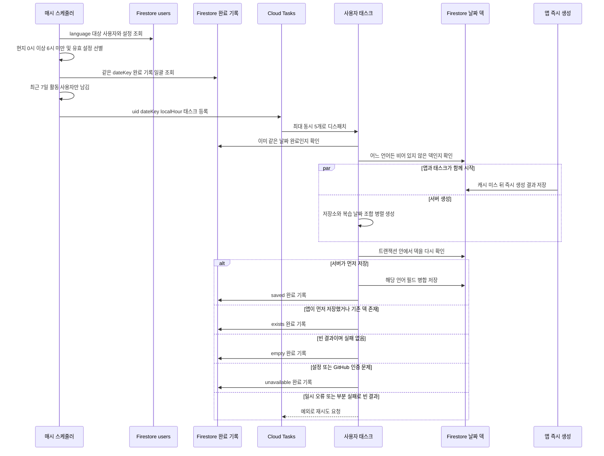

## 목적과 경계

앱의 `useTodayFlashcards`는 먼저 `users/{uid}/flashcards/{YYYY-MM-DD}`에서 현재 언어 덱을 읽는다. 덱이 있으면 즉시 표시하지만, 현재·반대 언어 덱이 모두 없으면 브라우저가 저장소별·복습 날짜별 GitHub 조회와 AI 생성을 수행한다. 사전 생성은 이 **캐시 미스의 첫 화면 대기**를 줄이기 위해, 사용자의 현지 날짜가 바뀐 뒤 서버가 같은 날짜 문서의 덱을 먼저 채우는 보완 경로다. 사전 생성 대상이 아니거나 생성에 실패해도 앱의 기존 즉시 생성 경로는 유지된다. 생성 경로와 언어 전환의 우선순위는 [카드 생성 경로](generation-paths.md)를 참고한다.

서버는 앱과 별도 덱이나 별도 날짜 규칙을 만들지 않는다. 앱이 열릴 때 브라우저의 IANA 시간대와 현재 표시 언어(`ko` 또는 `en`)를 `users/{uid}`에 best-effort로 동기화하고, 서버는 그 값을 사용해 `dateKey`와 카드 언어를 정한다. 날짜 계산은 `Intl` 기반이며, 현지 날짜의 자정부터 다음 자정 직전까지를 GitHub 커밋 조회 구간으로 계산하므로 서머타임 전환일도 해당 시간대의 경계를 따른다.

- **읽기·쓰기 대상:** 생성 결과는 `data_ko` 또는 `data_en`만 병합해 사용자 날짜 덱에 쓴다. 서버는 해당 문서에 비어 있지 않은 덱이 어느 언어로든 있으면 생성하지 않는다. 다른 언어를 나중에 채우는 책임은 앱의 번역 경로에 있다.
- **서버 전용 상태:** `flashcardPregeneration/{uid}`에는 그 사용자·날짜의 처리가 끝났다는 기록을 둔다. 이 컬렉션에는 Firestore 규칙의 `match`가 없으므로 클라이언트는 읽거나 쓰거나 삭제할 수 없다. 소유권 경계는 [Firestore 데이터 경계](../architecture/firestore-data-boundary.md)를 참고한다.
- **공유 계약:** Free는 `[1, 7]`, Pro는 `[1, 7, 30]`일 전을 대상으로 한다. 이 상수와 카드 형태는 앱 즉시 생성 경로와 맞춰야 한다. 저장 전에는 서버의 `fitFlashcardDeckToBudget`으로 덱을 축소한다. 크기 예산은 [덱 문서 크기 예산](deck-size-budget.md)에 있다.

## 스케줄, 큐, 저장 경쟁

`functions/src/index.ts`가 두 함수를 배포한다. `scheduleFlashcardPregeneration`은 `asia-northeast3`에서 매시 정각(`0 * * * *`) 실행되어 대상만 골라 Cloud Tasks에 넣고, `pregenerateUserFlashcards`가 사용자 한 명의 네트워크·AI 작업을 수행한다. Functions 전역 인스턴스 상한은 10개이고, 이 태스크 큐는 동시 디스패치를 5개로 제한한다. 태스크 하나도 저장소 최대 5개와 날짜 최대 3개, 즉 최대 15개의 조합을 병렬 처리할 수 있으므로 이 제한은 OpenAI 호출량을 조절하는 운영 경계다.



*스케줄러의 대상 선정, 큐의 제한된 실행, 앱과 서버의 날짜 덱 저장 경쟁, 완료·재시도 분기를 보여 준다.*

### 대상 선정과 중복 등록 방지

스케줄러는 `users`에서 `language in ["ko", "en"]`인 문서의 `timezone`, `language`, `repositories`만 읽는다. 이후 다음을 모두 통과한 사용자만 후보가 된다.

1. `timezone`은 런타임이 인식하는 IANA 시간대이고, 언어는 `ko` 또는 `en`이며, 선택 저장소가 하나 이상 있어야 한다. 시간대 또는 언어가 없으면 새 앱을 아직 열지 않은 경우로 보고 언어를 추측해 생성하지 않는다.
2. 스케줄 시각을 각 사용자의 현지 시각으로 바꿨을 때 0시 이상 6시 미만이어야 한다. 한 번의 자정만 노리지 않는 6시간 창이므로 스케줄러 또는 큐가 한 시각에 실패해도 사용자가 활동하기 전에 다음 정각에 따라잡을 기회가 있다.
3. 완료 기록의 `dateKey`가 후보의 현지 오늘과 같으면 제외한다. 완료 기록은 한 사용자당 문서 하나이며, 스케줄러는 최대 100개씩 `getAll`로 확인한다.
4. Firebase Auth에서 최대 100명씩 조회해 `lastRefreshTime`을 우선하고 없으면 `lastSignInTime`을 사용한다. 기준 시각에서 7일 이내인 사용자만 남긴다. 열린 앱의 토큰은 주기적으로 갱신되므로 별도 활동 필드 없이 유휴 계정의 GitHub·AI 비용을 피한다.

등록 태스크의 본문은 `uid`, 현지 `dateKey`, `localHour`이고 ID는 `${uid}-${dateKey}-h${localHour}`다. 같은 정각의 스케줄러 재실행은 `functions/task-already-exists`를 성공적으로 건너뛰므로 중복 등록하지 않는다. 다음 정각은 다른 ID이므로 아직 완료되지 않은 사용자를 다시 등록할 수 있다. 개별 enqueue 실패가 하나라도 있으면 스케줄러는 예외를 던진다. 스케줄러 자체는 최대 3회, 최소 60초·최대 1,800초 간격으로 재시도하며, 이미 들어간 태스크는 결정적 ID 덕분에 안전하다.

## 태스크의 생성과 저장 규칙

태스크는 시작할 때 완료 기록을 다시 확인한다. 이전 시각 태스크가 늦게 완료된 뒤 다음 시각 태스크가 도착한 경우를 막기 위함이다. 이어 사용자 문서에서 설정과 `githubToken`을 읽는다. 설정 또는 토큰이 없으면 더 시도해도 해결되지 않는 상태로 보고 `unavailable`을 기록하고 종료한다.

덱 생성은 설정된 저장소별로 병렬 실행하고, 각 저장소 안에서도 복습 날짜별로 병렬 실행한다. 브랜치가 설정돼 있지 않으면 GitHub 기본 브랜치를 조회하되, 일반 조회 실패는 브랜치 없이 GitHub 기본값 조회로 계속한다. 각 조합은 사용자 시간대의 해당 하루에서 파일 변경이 있는 첫 커밋을 찾고, 상세 커밋의 diff를 공용 `generateFlashcardItems`에 보낸다. GitHub 401은 `GitHubAuthError`로 구분한다. 생성 함수의 GitHub 인증, diff 형식, OpenAI Structured Outputs 계약은 [카드 생성 경로](generation-paths.md)를 참고한다.

생성 전 일반 읽기는 불필요한 AI 호출을 줄이고, 저장 트랜잭션의 재검사는 경쟁에서 데이터 손실을 막는다. `hasDeck`은 `data_ko`와 `data_en` 중 하나라도 비어 있지 않은 배열인지 검사한다.

- 일반 읽기에서 기존 덱을 발견하면 `exists`를 기록하고 AI 호출 없이 끝낸다.
- 생성 결과가 있으면 덱 크기를 맞춘 뒤 트랜잭션 안에서 다시 `hasDeck`을 검사한다. 여전히 없을 때만 선택 언어 필드를 `{merge: true}`로 저장하고 `saved`를 기록한다.
- 트랜잭션 사이에 앱이 먼저 저장했다면 트랜잭션은 쓰지 않고 `false`를 반환하며, 태스크는 `exists`를 기록한다. 따라서 서버는 앱이 생성한 어느 언어 덱도 덮어쓰지 않는다.

## 완료 기록과 실패 의미

덱 문서가 없다는 사실만으로는 **카드가 될 커밋이 없었다**는 것과 **아직 생성하지 않았거나 실패했다**는 것을 구별할 수 없다. 전자를 완료로 취급하지 않으면 커밋 없는 활성 사용자를 매시 다시 조회·생성하고, 후자를 완료로 취급하면 일시 장애 뒤 덱이 영구히 비게 된다. 그래서 작업이 확정적으로 끝난 경우에만 별도 완료 기록에 `{ dateKey, outcome, updatedAt }`를 쓴다.

| `outcome` | 확정 의미 | 이후 처리 |
|---|---|---|
| `saved` | 축소한 카드 덱을 서버가 저장했다 | 같은 날짜 후보에서 제외 |
| `exists` | 앱 또는 다른 경로가 먼저 비어 있지 않은 덱을 저장했다 | 같은 날짜 후보에서 제외 |
| `empty` | 모든 조합이 정상적으로 끝났지만 카드가 하나도 없었다 | 커밋 없음으로 확정하고 같은 날짜 후보에서 제외 |
| `unavailable` | 설정·GitHub 토큰이 없거나 GitHub 토큰이 무효다 | 재시도해도 바뀌지 않는 문제로 보고 같은 날짜 후보에서 제외 |

실패는 결과가 비어 있는지와 원인을 함께 판단한다. 조합별 일반 오류는 로그를 남기고 다른 조합을 계속 생성하며 `failedCount`를 올린다. 모든 결과가 비었고 실패도 없을 때만 `empty`다. 일부 조합이 실패한 채 덱이 비었으면 그 조합에 카드가 될 커밋이 있었을 수 있으므로 완료 기록을 쓰지 않고 예외를 던진다. GitHub 인증 오류는 예외적으로 결정적 실패라 `unavailable`으로 끝낸다. 그 밖에 OpenAI·GitHub 네트워크·파싱 같은 일시 오류가 태스크까지 전파되면 Cloud Tasks는 최대 3회, 최소 120초 backoff로 재시도한다. 세 번 모두 실패해도 완료 기록이 없으므로 새벽 창 안의 다음 정각 스케줄러가 새 ID의 태스크를 다시 넣을 수 있다.

카드가 일부라도 만들어진 경우에는 부분 실패 수가 있어도 그 덱을 저장하고 `saved`로 완료한다. 이는 이미 사용 가능한 첫 화면 결과를 보존하는 선택이다. 반대로 **부분 실패 + 빈 결과**만 미처리로 남기는 것이 빈 덱과 실패를 혼동하지 않는 핵심 불변식이다.

## 변경 및 운영 점검

- 시간대·언어 동기화는 앱의 best-effort `updateDoc`이다. `users` 규칙에서 두 필드를 클라이언트 허용 목록·형식 검증에 포함하므로, 필드명이나 허용 언어를 바꾸면 앱, 규칙, 서버의 `readPregenerationSettings`를 함께 바꾼다.
- 복습 간격, `FlashcardData` 메타데이터, 덱 축소 정책은 앱과 Functions에 복제돼 있다. 한쪽만 바꾸면 즉시 생성과 사전 생성이 같은 날짜 문서에 다른 계약의 데이터를 기록한다.
- 큐 함수명은 `pregenerateUserFlashcards` export 이름과 큐 경로가 일치해야 한다. 리전, 동시 실행 수, 540초 timeout, 재시도 값은 비용·OpenAI 속도 제한·새벽 창 완료율의 trade-off이므로 부하 근거 없이 따로 조정하지 않는다.
- 배포 전 Functions를 빌드·정적 검사하고, 로컬 Emulator와 배포 명령은 [로컬 개발 및 배포](../operations/local-development-and-deployment.md)를 따른다.

```bash
pnpm --prefix functions run lint
pnpm --prefix functions run build
```

현재 `functions/`와 `app/`에는 전용 테스트 파일이 없다. 이 워크플로를 변경할 때는 최소한 Emulator 또는 의존성 mock으로 다음을 검증하는 테스트를 추가하는 것이 안전하다: 시간대 경계와 서머타임 날짜 범위, 7일 활동 필터와 완료 사용자 제외, 같은 태스크 ID의 멱등 등록, 앱 저장과 트랜잭션 저장의 경쟁, `empty`와 부분 실패의 구분, GitHub 401의 `unavailable`, 태스크 예외가 완료 기록 없이 재시도되는 경로.
