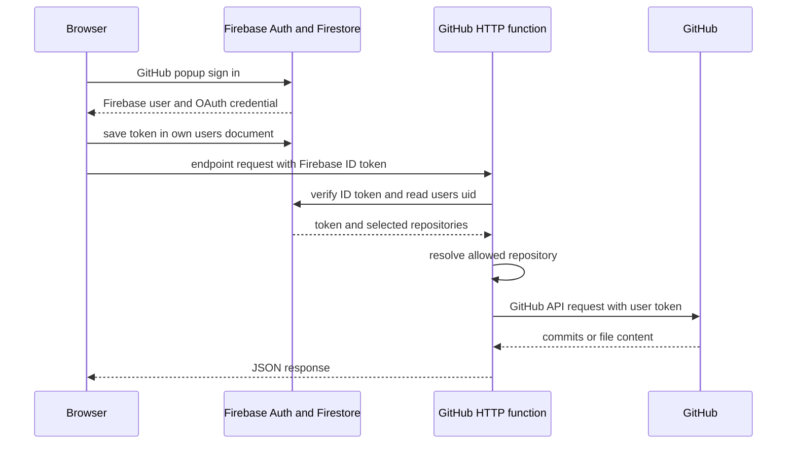

# GitHub 인증과 커밋 조회 경계

이 애플리케이션은 GitHub API를 브라우저에 사용자 OAuth 토큰을 넣어 직접 호출하지 않는다. 로그인 후 토큰은 사용자의 Firestore 문서에 저장되고, 앱은 Firebase ID 토큰만 Cloud Functions 프록시에 보낸다. 함수가 그 ID 토큰의 `uid`로 사용자 문서를 읽어 GitHub 요청에 Bearer 토큰을 붙인다. 따라서 브라우저와 GitHub 사이의 권한 위임은 **Firebase 인증 → 서버의 사용자 토큰 조회 → GitHub API 호출** 순서이며, 앱 API의 공개 URL 자체가 GitHub 권한을 뜻하지는 않는다.

이 문서는 커밋과 파일 원문을 읽는 HTTP 프록시의 범위를 다룬다. 카드 생성 전체의 캐시·AI 생성 경로는 [카드 생성 경로](../flashcard/generation-paths.md), 공개 AI 엔드포인트의 별도 호출량 경계는 [공개 AI 함수 호출 경계](../architecture/ai-call-guard.md), 사용자 문서의 읽기·쓰기 규칙은 [Firestore 데이터 경계](../architecture/firestore-data-boundary.md)를 참고한다.

*로그인 사용자 커밋 조회에서 브라우저는 Firebase ID 토큰만 프록시에 보내고, GitHub OAuth 토큰은 함수가 사용자 문서에서 읽어 외부 API 호출에 사용한다.*

## 인증 자료의 수명과 소유자

### 로그인 시 저장되는 값

`githubProvider`는 `user:email`과 `repo` scope를 요청한다. `Login`은 `signInWithPopup` 결과에서 GitHub credential의 access token을 얻어 `users/{uid}.githubToken`에 저장한다. 기존 사용자 문서가 있으면 토큰과 `updatedAt`만 갱신하여 저장소 설정을 유지하고, 새 문서면 해당 필드로 문서를 만든다. 값 자체나 특정 사용자·저장소 정보는 로그나 위키에 기록해서는 안 된다.

`githubToken`은 Firebase Auth 세션의 ID 토큰과 다른 자격 증명이다. `apiClient`는 로그인된 `auth.currentUser`에서 짧게 쓸 Firebase ID 토큰을 얻어 `Authorization: Bearer ...`에 넣지만, GitHub 토큰을 HTTP 함수 요청에 넣지 않는다. 이 분리는 브라우저 코드가 GitHub API 호출 권한을 직접 다루지 않게 하고, 서버가 호출자 `uid`와 Firestore의 토큰·설정을 함께 확인할 수 있게 한다.

Firestore 규칙은 본인만 `users/{uid}`를 읽고 쓰게 하며, 클라이언트가 쓸 수 있는 필드를 허용 목록과 타입·길이로 제한한다. 여기에는 `githubToken`과 `repositories`도 포함된다. 즉 규칙은 다른 Firebase 사용자에 의한 읽기를 막지만, 토큰은 사용자 문서에 존재하므로 클라이언트 신뢰 경계 밖으로 노출하지 않도록 UI·로그·분석 이벤트에서 값을 다루지 않는 것이 전제다.

### 프록시가 확인하는 것

`getCommits`, `getFilename`, `getMarkdown`은 먼저 `Authorization` 헤더가 Bearer Firebase ID 토큰인지 검사하고 Admin SDK로 검증한다. 이어 검증된 `uid`의 `users` 문서에서 `githubToken`과 비어 있지 않은 `repositories` 배열을 읽는다. 토큰, 사용자 문서 또는 저장소 설정이 없으면 GitHub에 요청하지 않는다. 이 세 엔드포인트는 CORS와 `invoker: "public"`로 배포되지만, 이는 브라우저와 preflight가 도달할 수 있다는 뜻일 뿐 인증된 GitHub 조회를 익명에게 열지 않는다.

클라이언트 래퍼는 다음 함수 URL만 호출한다.

| 앱 함수 | 프록시 엔드포인트 | 용도 |
| --- | --- | --- |
| `getRepositories` | `/getRepositories` | OAuth 토큰으로 접근 가능한 저장소 목록을 설정 화면에 제공 |
| `getCommits` | `/getCommits` | 날짜 범위와 선택 저장소의 커밋 목록 조회 |
| `getFilename` | `/getFilename` | 선택 저장소 안의 특정 커밋 상세·파일 변경 조회 |
| `getMarkdown` | `/getMarkdown` | 선택 저장소의 경로를 raw 형식으로 조회 |
| `getFileContent` | `/getFileContent` | 카드 메타데이터의 raw URL을 프록시로 가져옴 |

목록과 상세를 분리한 이유도 중요하다. 카드 생성은 먼저 날짜 범위의 커밋 목록을 얻고, 파일 목록과 patch가 필요한 커밋만 상세 조회한다. 앱은 변경 파일이 있는 첫 상세 커밋을 diff로 구성한다. 사전 생성 작업도 같은 선택 규칙으로 사용자 문서의 토큰을 읽어 서버에서 GitHub를 호출한다.

## 선택 저장소와 브랜치

### 설정이 만드는 허용 목록

온보딩은 서버의 `/getRepositories` 결과에서 한 저장소를 고른 뒤 `repositories: [{ fullName, url, branch? }]`를 사용자 문서에 저장한다. 설정 화면은 같은 목록을 다시 불러오며 Free는 하나, Pro는 최대 다섯 저장소를 저장한다. 저장소를 변경하면 기존 플래시카드를 삭제하고 새로고침해 재생성한다. 규칙은 배열을 최대 다섯 항목으로 제한하고, 각 항목에 `fullName`과 HTTPS `url` 및 선택적 문자열 `branch`만 허용한다.

커밋·커밋 상세·마크다운 프록시는 클라이언트가 보낸 `repositoryFullName`이 이 저장된 `repositories`의 `fullName`과 정확히 일치할 때만 사용한다. 없거나 일치하지 않으면 첫 번째 설정 저장소로 되돌아간다. 이는 임의의 `owner/repo`를 쿼리에 넣어 다른 저장소를 조회하는 일을 막는 서버 측 범위 확인이다. 저장소 목록 자체도 사용자 문서의 토큰으로 GitHub `/user/repos`를 호출해서만 얻는다.

### 브랜치 적용과 주의점

선택된 각 저장소에는 선택적으로 브랜치를 저장할 수 있다. 온보딩과 설정은 `/getBranches`로 목록을 채우며, 저장소를 전환하거나 선택 해제한 뒤 도착한 오래된 응답은 무시한다. `getBranches`는 현재 deprecated로 표시되어 있으며, 호출자 인증과 토큰만 확인하고 요청의 `owner`/`repo`가 설정 저장소인지 확인하지 않는다. 이 엔드포인트는 브랜치 이름을 UI에 표시하는 보조 기능으로 취급하고, 새 기능이 이를 권한 검증 수단으로 가정해서는 안 된다.

`getCommits`는 저장된 브랜치가 있으면 GitHub commits API의 `sha`에 사용한다. 호출 쿼리에 비어 있지 않은 `branch`가 있으면 현재 구현은 저장된 브랜치보다 그 값을 우선한다. 이 값은 저장된 브랜치 목록과 대조하지 않는다. 반면 `repositoryFullName`만은 허용 목록과 대조한다. 따라서 현재의 저장소 경계는 강제되지만, 브랜치 고정 경계는 아니다. 특정 브랜치만을 보안 또는 재현성 요구사항으로 강제하려면, 서버에서 요청 브랜치를 저장된 브랜치와 비교해 거부하거나 무시하고, `getMarkdown`에도 동일한 ref를 전달하도록 함께 변경해야 한다.

`getFilename`은 커밋 SHA로 상세를 읽고, `getMarkdown`은 `/contents/{filename}`을 ref 없이 읽으므로 GitHub 기본 브랜치의 현재 파일을 반환한다. 카드 파일 보기는 가능한 경우 파일 메타데이터의 `raw_url`을 우선 사용하여 커밋 시점 원문을 요청하고, 오래된 카드처럼 raw URL이 없을 때만 `getMarkdown`으로 폴백한다. 그러므로 브랜치와 커밋 시점이 중요한 화면은 raw URL이 있는 메타데이터를 보존해야 한다.

## 로그인·데모·raw URL의 서로 다른 경계

| 경로 | 호출 주체와 인증 | 대상 범위 | private 저장소 |
| --- | --- | --- | --- |
| 로그인 커밋/상세/마크다운 | Firebase ID 토큰 검증 후 사용자 문서의 GitHub 토큰 사용 | 저장된 `repositories` 중 하나, 불일치 시 첫 저장소 | 사용자 토큰 권한이 있으면 가능 |
| 로그인 raw 파일 | Firebase ID 토큰이 유효하고 문서에 GitHub 토큰이 있으면 선택적으로 첨부 | 허용된 GitHub 호스트의 URL | 토큰이 해당 URL에 권한이 있으면 가능 |
| 비로그인 raw 파일 | Firebase·GitHub 토큰 없이 요청 | 허용된 GitHub 호스트의 공개 URL | 불가 |
| 랜딩 데모 커밋 | 브라우저가 GitHub Public API를 직접 호출, 토큰 없음 | 사용자가 입력한 공개 GitHub URL의 기본 또는 지정 브랜치, 최근 커밋 | 불가 |

랜딩 데모는 로그인 사용자 흐름의 예외다. `generateDemoFlashcards`는 Firebase/Firestore에 저장하지 않고 브라우저에서 GitHub Public API로 기본 브랜치와 최근 세 커밋 및 각 상세를 조회한다. 404는 저장소를 찾지 못한 경우로, 그 밖의 비정상 응답은 GitHub API 실패로 다룬다. 토큰이 없으므로 이 경로는 공개 저장소만 성공할 수 있다. 서버 측 데모 사전 생성의 공용 GitHub helper도 토큰이 없을 때 User-Agent만 넣어 공개 저장소를 읽는다.

### raw URL 프록시의 허용 목록

`getFileContent`는 raw URL을 `URL`로 파싱한 뒤 hostname이 `github.com`, `raw.githubusercontent.com`, `api.github.com` 중 하나일 때만 `fetch`한다. 이는 프록시가 클라이언트가 제공한 임의의 인터넷 주소나 내부 주소로 요청하는 SSRF 성격의 경로가 되는 것을 줄이기 위한 출발점이다. 잘못된 URL 또는 목록 밖 호스트는 `400`으로 끝난다.

이 엔드포인트는 커밋/마크다운 엔드포인트와 의도적으로 경계가 다르다. 데모 카드도 파일 내용을 볼 수 있어야 하므로 Firebase ID 토큰이 없으면 익명으로 공개 raw 리소스만 가져온다. ID 토큰이 유효하고 사용자 문서에 GitHub 토큰이 있으면 그 토큰을 원격 요청에 붙여 private raw 리소스도 읽을 수 있다. 하지만 이 선택적 토큰 조회는 `repositories` 설정을 요구하지 않고 raw URL을 선택 저장소에 묶지 않는다. 또한 허용 목록은 **초기 URL의 hostname**만 검사한다. 따라서 이 기능을 임의 URL 프록시나 선택 저장소 강제 장치로 확장해서는 안 되며, 더 강한 경계가 필요하면 URL의 owner/repository/path를 파싱해 저장된 `repositories`와 대조하고 redirect 정책도 명시적으로 제한해야 한다.

## 실패 의미와 운영·확장 시 확인할 점

- GitHub가 비성공 상태를 반환하면 프록시는 대체로 그 상태 코드와 오류 본문을 전달하고, 입력 누락·잘못된 raw URL은 `400`으로 응답한다. 인증·설정 검증 중 던져진 오류는 `getCommits`·`getFilename`·`getMarkdown`의 공통 catch에서 현재 `500`으로 포장되므로, 클라이언트는 단순히 GitHub 장애로 오인하지 않도록 로그인·재로그인·저장소 설정 안내를 제공해야 한다. `getRepositories`와 `getBranches`는 헤더 누락을 명시적으로 `401`로 응답한다.
- 사용자별 사전 생성은 토큰이나 설정이 없거나 `GitHubAuthError`가 나면 그 날짜를 `unavailable`로 완료 처리한다. 일반 GitHub/네트워크 오류로 일부 조합이 실패해 빈 덱이 되면 완료 기록 없이 재시도한다. 토큰 만료를 자동 복구하지 않으므로 재로그인이 갱신 경로다.
- `apiClient`의 개발 기본 URL은 `/api`이고 프로덕션에서는 `VITE_FUNCTIONS_URL_PROD`를 사용한다. 프록시를 배포·로컬 연결할 때 함수 이름, CORS 및 이 base URL이 함께 맞아야 한다.
- 이 영역에는 `github.ts` 또는 앱 프록시 래퍼를 대상으로 한 전용 테스트 파일이 없다. 변경 시에는 적어도 ID 토큰 없음·유효하지 않음, 저장소 미설정, 허용/비허용 `repositoryFullName`, 저장된 브랜치와 쿼리 브랜치의 우선순위, raw URL의 세 호스트와 비허용 호스트, 로그인/비로그인에서 public·private 응답을 테스트로 고정하는 것이 좋다.
