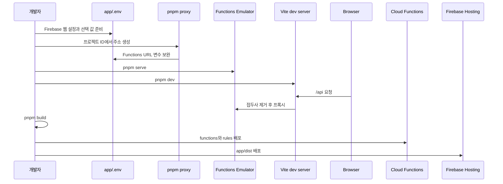

# 로컬 실행과 Firebase 배포

이 저장소는 Vite 기반 브라우저 패키지 `app`과 Firebase Cloud Functions 패키지 `functions`를 **서로 별도로 빌드**한다. 개발 중 브라우저의 Functions 요청은 Vite의 `/api` 프록시를 거쳐 Functions Emulator로 가고, 배포 번들은 Functions 공개 URL을 직접 호출한다. Firestore·Authentication은 현재 `pnpm serve`가 띄우는 에뮬레이터 범위가 아니므로, 로컬 앱도 `app/.env`가 가리키는 Firebase 프로젝트의 클라이언트 SDK를 사용한다. 로컬 Functions만 격리된다는 점을 이해하고 공유 프로젝트에서 쓰기 동작을 시험할 때 특히 주의한다.



*환경 변수 생성부터 로컬 프록시, 그리고 명시적으로 빌드한 Hosting 산출물과 Functions·규칙을 배포하는 순서다.*

## 시작 전: 의존성, 프로젝트 연결, 비밀 관리

Node.js 22 이상, pnpm, Firebase CLI가 필요하다. 루트의 package manager는 `pnpm@10.18.0`이고 Functions 런타임도 Node.js 22를 선언한다. 의존성은 루트에서 한 번 설치한다.

```bash
pnpm install
```

Firebase 로그인 뒤에는 현재 작업 사본에 사용할 프로젝트를 선택한다. `.firebaserc`는 무시되는 로컬 연결 파일이므로 새 clone 또는 worktree에서는 다시 연결하고, 배포 전에도 활성 선택을 확인한다.

```bash
firebase login
firebase use --add
firebase use
```

`firebase init`은 실행하지 않는다. 저장소가 이미 `firebase.json`, `firestore.rules`, `functions` 코드베이스 설정을 소유한다. 초기화 마법사는 이 배포 설정이나 규칙을 변경·덮어쓸 위험이 있으므로, 프로젝트 연결에는 `firebase use --add`만 사용한다.

`app/.env.example`을 `app/.env`로 복사해 Firebase 웹 SDK가 초기화에 쓰는 `VITE_API_KEY`, `VITE_AUTH_DOMAIN`, `VITE_PROJECT_ID`, `VITE_STORAGE_BUCKET`, `VITE_MESSAGING_SENDER_ID`, `VITE_APP_ID`, `VITE_MEASUREMENT_ID`를 준비한다. 웹 푸시를 사용할 때는 `VITE_VAPID_KEY`, 분석을 사용할 때는 선택적으로 `VITE_CLARITY_PROJECT_ID`도 설정한다. Functions의 AI 경로에는 `functions/.env`의 `OPENAI_API_KEY`가 필요하다. 어떤 파일도 저장소에 커밋하지 말고, 값·키·운영 프로젝트 식별자를 문서나 로그에 복사하지 않는다.

```bash
cp app/.env.example app/.env
```

## `pnpm proxy`: 주소를 만드는 빌드 전 계약

`pnpm proxy`는 `scripts/setup-proxy.js`를 실행한다. 이 스크립트는 `app/.env`의 `VITE_PROJECT_ID`를 읽어 아래의 Functions 관련 키를 보완한다.

| 키 | 용도 |
| --- | --- |
| `VITE_FIREBASE_PROJECT_ID` | Functions 주소 구성에 쓰는 Firebase 프로젝트 ID의 복사본 |
| `VITE_FIREBASE_REGION` | Functions 리전 |
| `VITE_FUNCTIONS_URL_LOCAL` | Vite 개발 프록시가 향할 Emulator 기본 URL |
| `VITE_FUNCTIONS_URL_PROD` | 프로덕션 브라우저가 HTTP Functions를 호출할 기본 URL |

이 명령은 파일이나 `VITE_PROJECT_ID`가 없으면 실패한다. 이미 값이 있는 키는 **덮어쓰지 않으며**, 빈 값만 채운다. 따라서 Firebase 프로젝트나 리전을 바꿨다면 기존의 비어 있지 않은 URL이 새 프로젝트와 일치하는지 확인해야 한다. 단순히 명령을 다시 실행하는 것만으로 오래된 값이 교체되지는 않는다.

Functions URL은 런타임에 서버에서 발견되는 설정이 아니다. Vite는 production 모드에서 `VITE_FUNCTIONS_URL_PROD`를 읽고, API 모듈은 이를 프로덕션 번들에 포함해 함수 이름을 붙여 요청한다. 반대로 development 모듈은 `/api`만 요청한다. 즉 URL·리전·프로젝트를 변경한 뒤에는 다음을 반드시 지킨다.

1. `app/.env`의 `VITE_PROJECT_ID`와 자동 생성 Functions URL 키가 의도한 프로젝트·리전을 가리키는지 검토한다.
2. `pnpm proxy`로 누락되거나 빈 키를 보완한다.
3. Vite 개발 서버를 재시작하고, 배포용이면 `pnpm build`로 **새 번들**을 만든다.
4. 이미 배포된 Hosting 파일은 이전 URL을 포함하므로, Functions만 재배포해서 클라이언트의 호출 대상을 바꿀 수 없다는 점을 확인한다.

이 계약은 공개 URL을 비밀로 만드는 장치가 아니다. 공개 AI HTTP 함수는 URL 은닉 대신 서버의 인증·입력·사용량 경계로 보호한다. 호출 보안의 상세는 [공개 AI 함수 호출 경계](../architecture/ai-call-guard.md)를 참고한다.

## 로컬 실행: Functions 먼저, Vite는 별도 터미널

다음 순서로 실행한다.

```bash
pnpm proxy
pnpm serve
```

다른 터미널에서 다음을 실행한다.

```bash
pnpm dev
```

루트 `pnpm serve`는 먼저 Functions TypeScript를 빌드한 다음 `firebase emulators:start --only functions`를 실행한다. Functions 패키지의 `serve`도 같은 역할을 한다. Functions가 컴파일되지 않았거나 Emulator가 준비되기 전에 Vite를 띄우면 `/api` 요청을 신뢰성 있게 확인할 수 없으므로 백엔드를 먼저 준비한다.

Vite 설정은 development 모드에서 `VITE_FUNCTIONS_URL_LOCAL`을 `/api`의 target으로 선택하고, `/api` 접두사를 제거해 전달한다. 예를 들어 프런트엔드의 `/api/openaiChatCompletions` 요청은 Emulator의 `/openaiChatCompletions`로 전달된다. 프로덕션에서는 이 프록시 경로가 아니라 `VITE_FUNCTIONS_URL_PROD`에 같은 함수 이름을 붙여 호출한다. Functions 이름 또는 HTTP 경로를 바꾸면 개발 프록시와 프로덕션 API 모듈을 함께 확인해야 한다.

`--only functions`은 Firestore, Auth, Hosting Emulator를 시작하지 않는다. 또한 앱 Firebase 초기화에는 `connectFirestoreEmulator`나 `connectAuthEmulator` 연결이 없다. 따라서 로컬에서 Firestore 읽기·쓰기를 수행할 경우 선택한 Firebase 프로젝트의 규칙과 데이터에 영향을 준다. 규칙 변경을 안전하게 점검하려면 먼저 인증·소유자·공개 읽기·거부되어야 할 쓰기를 실제 테스트용 프로젝트에서 작은 범위로 확인하고, 운영 프로젝트를 선택한 상태에서 임의 데이터를 만들지 않는다.

Functions의 `OPENAI_API_KEY`가 없으면 AI HTTP 함수는 오류를 응답한다. 키가 필요한 호출을 검증할 때는 키가 로컬에 존재하는지 확인하되, 터미널 출력·스크린샷·PR에 값을 노출하지 않는다. AI 호출의 쿼터와 실패 의미는 [공개 AI 함수 호출 경계](../architecture/ai-call-guard.md)에, 서버 사전 생성 작업은 [오늘의 플래시카드 사전 생성](../flashcard/pregeneration.md)에 정리되어 있다.

## 빌드와 배포 불변식

루트 `pnpm build`는 워크스페이스 전체의 build 스크립트를 실행한다. `app`은 `tsc && vite build`로 `app/dist`를 만들고, `functions`는 `tsc`로 `functions/lib`을 만든다.

```bash
pnpm build
pnpm --filter functions lint
```

`firebase.json`에서 Functions는 배포 직전에 `pnpm --prefix "$RESOURCE_DIR" run build`라는 predeploy를 실행한다. 따라서 Functions 단독 배포에는 컴파일 보호막이 있다. 반면 Hosting 설정의 public 디렉터리는 `app/dist`지만 **Hosting에는 predeploy가 없다.** `firebase deploy`나 `firebase deploy --only hosting`은 Vite를 실행하지 않고 현재 존재하는 `app/dist`를 업로드한다.

따라서 다음은 배포 불변식이다.

> Hosting을 배포하기 전에는, 현재 검토한 환경 변수로 `pnpm build`를 성공시켜 새 `app/dist`를 만들어야 한다.

이를 생략하면 배포가 실패할 수도 있지만, 더 위험하게는 이전 산출물이 남아 있으면 오래된 Functions URL·코드·정적 파일을 정상 배포처럼 올릴 수 있다. `app/dist`와 `functions/lib`은 무시되는 생성물이라 clone 후에는 특히 이 순서를 생략할 수 없다.

Hosting은 `/app`과 `/app/**`를 `app.html`로 rewrite하고 `/terms`, `/privacy`는 각 정적 HTML로 보낸다. `vite.config.ts`는 랜딩, 앱, 약관, 개인정보 HTML을 다중 입력으로 빌드한다. 라우트나 엔트리 변경 배포에서는 루트 랜딩, `/app` 새로고침, 약관·개인정보 경로가 모두 새 `app/dist`에서 의도한 문서를 내는지 점검한다.

## 안전한 배포 절차

영향 범위를 분리해 검증하고 배포한다. Functions와 Firestore 규칙이 같이 바뀌면 먼저 두 서버 측 단위를 배포해 API와 권한 계약을 맞춘 뒤, 검증한 번들을 Hosting에 올린다.

```bash
# 1. 활성 Firebase 프로젝트를 눈으로 확인
firebase use

# 2. app/.env의 Functions URL 계약을 확인한 뒤 전체 빌드 및 Functions 정적 검사
pnpm proxy
pnpm build
pnpm --filter functions lint

# 3. 서버 코드와 규칙 배포
firebase deploy --only functions,firestore:rules

# 4. 방금 만든 app/dist만 Hosting에 배포
firebase deploy --only hosting
```

전체 배포가 필요한 경우 루트 명령도 사용할 수 있다.

```bash
pnpm push
```

다만 `pnpm push`는 `firebase deploy`의 별칭일 뿐 Hosting 빌드를 대신하지 않는다. 위의 빌드·활성 프로젝트·환경 변수 점검을 먼저 수행한 뒤에만 사용한다. Functions만 수정했더라도 클라이언트 URL이나 응답 계약이 바뀌었다면 Hosting을 포함해 새 번들을 배포해야 한다. 반대로 정적 UI만 바뀐 경우에도 Hosting predeploy 부재 때문에 build는 여전히 선행 조건이다.

### 배포 전후 점검표

- `firebase use`가 의도한 프로젝트를 가리키는지 확인한다. 프로젝트 ID나 키 값을 문서화하거나 공유하지 않는다.
- `pnpm proxy` 실행 뒤 `VITE_FUNCTIONS_URL_PROD`가 현재 프로젝트·리전과 일치하는지, 비어 있지 않은 오래된 값이 남지 않았는지 확인한다.
- `pnpm build`와 `pnpm --filter functions lint`가 통과하는지 확인한다. 저장소에는 전용 자동 테스트 스위트가 없으므로 변경한 경계를 수동으로 확인한다.
- Functions 변경이면 Emulator에서 대표 HTTP 요청과 인증 실패 경로를 확인한다. 공개 AI 호출은 한도·외부 모델 비용이 있으므로 반복 호출을 무작정 하지 않는다.
- 규칙 변경이면 최소한 소유자 읽기·쓰기, 비소유자 접근 거부, 공개 캐시 읽기, 서버 전용 컬렉션의 클라이언트 거부를 확인한다. 규칙은 Admin SDK 경로에는 적용되지 않으므로 Functions의 인증·입력 검증도 별도로 점검한다.
- Hosting 배포 뒤 `/`, `/app`, `/app/` 하위 새로고침, `/terms`, `/privacy`를 확인하고, 실제 API 호출이 이전 번들 URL이 아니라 기대한 Functions 대상으로 향하는지 브라우저 네트워크 도구에서 확인한다.

Functions는 `index.ts`에서 HTTP·스케줄·태스크 트리거를 export하므로 서버 배포에는 이 집합이 함께 포함된다. 전역 컨테이너 상한도 함께 적용된다. 배포가 끝났다고 스케줄 작업의 결과까지 즉시 바뀌는 것은 아니다. 예를 들어 랜딩 데모 카드의 갱신·사전 생성은 별도 스케줄과 데이터 상태를 따르므로, 트리거 변경은 다음 실행 또는 의도적인 운영 검증 시점까지 관찰해야 한다.
