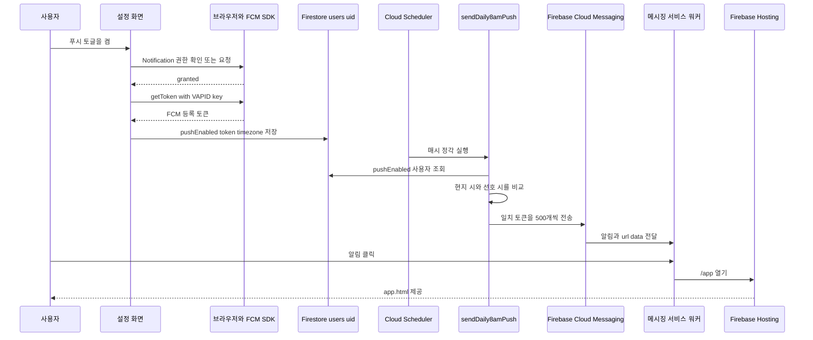

# 시간대 기반 푸시 알림

이 기능은 앱의 설정 화면에서 웹 푸시 권한을 받고 FCM 등록 토큰을 `users/{uid}`에 저장한 뒤, 서버의 `sendDaily8amPush`가 매시 대상자를 다시 골라 리마인더를 보내는 구조다. 토큰 전체를 브라우저에 노출하거나 클라이언트에서 전송하지 않는다. Cloud Functions의 Admin SDK가 `pushEnabled` 사용자를 조회하고 FCM을 호출한다.

FCM 토큰·운영 계정 정보·VAPID 값은 공개 저장소 문서, 이슈, 로그에 복사하지 않는다. 앱의 VAPID 공개 키는 로컬 `app/.env`의 `VITE_VAPID_KEY`로만 제공한다.

## 전체 흐름

*권한·토큰 등록에서 서버의 시간대 판정과 배치 전송을 거쳐, 알림의 `url` 데이터로 `/app`에 진입하는 흐름이다.*

브라우저 앱은 로드 시 `/firebase-messaging-sw.js`를 등록한다. 예약 작업이 보내는 메시지는 고정된 제목·본문과 `type: "daily-reminder"`, `url: "/app"` 데이터를 포함한다. Hosting은 `/app`과 `/app/**`를 `app.html`로 rewrite하므로 이 URL은 랜딩(`/`)이 아니라 인증 앱 진입점이다. 서비스 워커 등록 실패는 현재 무시되므로, 등록 실패 자체가 설정 UI에서 사용자에게 별도로 보고되지는 않는다.

## 설정, 권한 및 사용자 문서

### 켜기

로그인한 사용자만 토글을 켤 수 있다. 설정 화면은 다음 순서로 실행한다.

1. `Notification` API가 없는 환경이면 중단한다.
2. 현재 권한이 `default`일 때만 `Notification.requestPermission()`을 호출하고, 결과가 `granted`가 아니면 토글을 저장하지 않는다.
3. 동적 import한 `firebase/messaging`의 `getMessaging(app)`과 `getToken()`으로 등록 토큰을 얻는다. `VITE_VAPID_KEY`가 있으면 해당 옵션을 전달하고, 없으면 SDK 기본 호출을 사용한다. 빈 토큰도 실패로 취급한다.
4. 기존 사용자 문서의 `preferredPushTimezone`이 있으면 이를 유지하고, 없으면 `Intl.DateTimeFormat().resolvedOptions().timeZone`에서 현재 브라우저의 IANA 시간대를 얻는다.
5. `setDoc(..., { merge: true })`로 `pushEnabled: true`, `fcmToken`, `preferredPushTimezone`, `updatedAt`만 병합 저장한다.

토글을 끄면 `pushEnabled`만 `false`로 갱신한다. **기존 `fcmToken`은 삭제하지 않는다.** 다시 켤 때는 새 `getToken()` 결과로 덮어쓴다. 따라서 기기 교체·토큰 회전·권한 철회에 대한 토큰 정리 기능으로 오해해서는 안 된다.

### 시각과 시간대의 기본값

설정 로드 시 `preferredPushHour`가 숫자가 아니면 UI 상태는 `8`로 시작한다. 서버도 숫자가 아닌 값을 `8`로 해석한다. 서버는 `preferredPushTimezone`이 비어 있거나 문자열이 아니면 `Asia/Seoul`을 사용한다. 즉 오래된 문서나 설정이 불완전한 사용자는 **서울 시간 08시**에 후보가 된다.

시각 선택기는 Pro UI에만 있으며 0부터 23까지 선택할 수 있다. 값을 고를 때 현재 브라우저의 시간대를 함께 `preferredPushTimezone`에 기록한다. 반면 토큰 등록에서는 이미 저장된 시간대를 우선한다. 사용자가 여행하거나 기기 시간대를 바꿔도 토큰 등록만 다시 켜는 것으로 시간대가 갱신된다고 가정하면 안 되며, 현재 구현에서 시간대 갱신은 Pro의 시각 선택 저장 경로에 있다.

Firestore 규칙은 소유자만 자신의 `users/{uid}`를 읽고 쓰게 하며, `pushEnabled`, `fcmToken`, `preferredPushHour`, `preferredPushTimezone`을 클라이언트 허용 필드에 포함한다. 토큰은 최대 1,024자, 시간대 문자열은 최대 64자, 시각은 0–23 범위의 number로 제한한다. 규칙은 IANA 시간대의 유효성까지 검증하지 않는다.

## 매시 판정과 발송

`sendDaily8amPush`는 `asia-northeast3`에서 cron `0 * * * *`로 실행된다. Scheduler 트리거 자체의 기준 시간대는 `Asia/Seoul`이지만, 이는 실행 시각을 정하는 기준일 뿐 사용자 알림 시간을 서울 시간으로 고정하는 설정이 아니다.

전 세계 사용자를 하나의 특정 시각에 처리할 수 없으므로 매시 실행한다. 각 실행은 동일한 기준 시각을 사용자별 IANA 시간대로 바꾸고 현지 `hour`가 선호 시각과 일치할 때만 전송한다. 이렇게 하루 24번 훑어 UTC 오프셋이 다른 시간대를 포괄하며, `Intl.DateTimeFormat`이 현재 날짜의 시간대 규칙을 계산하므로 서머타임의 현지 시 판정도 런타임에 위임한다. `getHourInTimezone()`은 자정을 `24`로 출력하는 런타임을 0으로 정규화한다.

작업의 대상 및 순서는 다음과 같다.

1. Firestore에서 `pushEnabled == true`인 모든 사용자 문서를 읽는다.
2. 각 문서에서 문자열 `fcmToken`이 있고, 현지 시와 `preferredPushHour`가 같은 경우만 토큰 배열에 넣는다.
3. 토큰이 없으면 로그를 남기고 성공적으로 종료한다.
4. 토큰을 최대 500개 단위로 나누고, 각 배치의 메시지에 같은 notification/data payload를 넣어 `messaging.sendEach()`를 **순차적으로** 호출한다.
5. 응답별 성공·실패를 세고 마지막에 합계를 로그로 기록한다.

한 사용자 문서에는 단일 `fcmToken` 필드만 있으므로 이 모델은 사용자당 여러 브라우저·기기를 독립적으로 유지하지 않는다. 또한 조회 결과를 토큰 값으로 중복 제거하지 않으므로 서로 다른 문서가 같은 토큰을 보유하면 같은 실행에서 중복 전송될 수 있다.

## 실패 의미와 현재의 한계

발송 실패는 내구성 있는 운영 기록이 아니다. `sendEach()`가 정상 응답한 배치에서는 실패한 각 응답에 대해 토큰의 **배치 내 인덱스와 오류 메시지**를 `console.warn`에 남기고, 성공·실패 합계를 `console.log`에 남긴다. 실패 토큰을 사용자 문서에서 삭제하거나 `pushEnabled`를 끄거나, 실패 사유·재시도 상태를 Firestore에 저장하지 않는다. 무효·만료 토큰도 다음 시간에 다시 후보가 될 수 있다.

또한 작업 전체는 하나의 `try/catch`다. 잘못된 시간대 문자열은 `Intl.DateTimeFormat`에서 예외를 낼 수 있으며, 이 경우 이후 사용자 판정과 전송은 건너뛰고 오류만 로그에 남긴다. 한 배치의 `sendEach()` 자체가 reject해도 이후 배치는 실행되지 않는다. 함수가 오류를 로그만 남기고 반환하므로, 이 코드만으로는 Scheduler 재시도나 실패 배치 재처리를 보장하지 않는다.

따라서 현재 시스템이 보장하는 것은 “조건에 맞는 토큰에 전송을 시도하고 결과를 함수 로그로 관찰한다”는 수준이다. 다음은 아직 구현돼 있지 않다.

- FCM 오류 코드에 따른 무효 토큰 제거·비활성화
- 사용자·토큰·시각 단위의 영속적인 발송 이력, 실패 큐 또는 재시도 정책
- 잘못된 `preferredPushTimezone`을 개별 사용자만 제외하는 격리
- 토큰 갱신 및 다중 기기 토큰 집합 관리
- 사용자별 정확히 한 번 전송 보장

이 한계를 감춘 채 실패율이나 전달 보장을 운영 지표로 약속하지 않는다. 개선한다면 원문 토큰을 로그에 기록하지 말고, 오류 코드를 분류해 안전한 식별자 또는 집계만 저장하며, 정리·재시도 상태는 사용자 문서의 설정과 분리된 서버 전용 컬렉션에 둔다.

## 변경 시 함께 확인할 계약

- **필드 변경:** 클라이언트 설정 코드, `firestore.rules`의 허용 목록·타입/크기 검사, 스케줄러의 필드 읽기와 폴백을 함께 바꾼다. `users` 문서는 사용자가 삭제할 수 있으므로 전달 이력이나 재시도 상태를 여기에 추가하지 않는다. 데이터 경계는 [Firestore 데이터 경계](../architecture/firestore-data-boundary.md)를 따른다.
- **시간대 검증:** 현재 규칙은 길이만 검사한다. 유효성 검사를 추가하거나 서버에서 사용자별 예외를 격리할 때는 캐시된 과거 앱이 쓰는 기존 값과의 호환성을 검토한다. 기본값을 바꾸면 설정이 없는 모든 사용자에게 즉시 영향을 준다.
- **스케줄·용량:** `0 * * * *`를 하루 한 번의 서울 시간 cron으로 바꾸면 전 세계 현지 시각 보장이 사라진다. 배치 크기 500은 FCM `sendEach` 호출 단위이며, 병렬화·크기·리전 변경은 FCM 제한, 전체 `users` 조회 비용, Functions 전역 `maxInstances`와 함께 평가한다.
- **클릭 경로:** 알림 `data.url`, 서비스 워커의 클릭 처리, Hosting rewrite를 한 URL 계약으로 검증한다. `/`로 바꾸면 랜딩으로 향한다.
- **비밀과 배포:** `VITE_VAPID_KEY`는 `app/.env`에만 넣고, Functions 배포는 `firebase.json`의 `functions` 코드베이스와 빌드 훅을 따른다. 일반적인 환경 변수·빌드·배포 순서는 [로컬 실행과 Firebase 배포](local-development-and-deployment.md)를 참고한다.

## 검증 우선순위

현재 `functions/`와 `app/`에 전용 테스트 파일은 없다. 변경 전에는 최소한 다음을 확인한다.

1. `pnpm --prefix app run build`, `pnpm --prefix functions run build`, `pnpm --prefix functions run lint`를 실행한다.
2. 허용된 사용자만 토큰·푸시 설정을 읽고 쓸 수 있는지, 범위를 벗어난 시각과 과도한 토큰/시간대 값이 규칙에서 거부되는지 확인한다.
3. 권한 거부, 지원하지 않는 브라우저, 빈 토큰, 토글 해제, 기존 시간대 보존을 브라우저에서 확인한다. 실제 토큰이나 계정 정보를 테스트 산출물에 남기지 않는다.
4. 시간대 경계(특히 0시), `Asia/Seoul` 및 시각 8의 폴백, 서머타임 전환일, 잘못된 시간대 하나가 전체 작업에 미치는 영향을 mock 또는 테스트 프로젝트에서 검증한다.
5. 500개 경계의 배치, 일부 응답 실패, `sendEach` reject 시 이후 배치 미실행이라는 현재 동작을 확인하고, 실패 토큰 정리·재시도를 도입했다면 그 상태 전이와 개인정보 노출 없는 로그까지 검증한다.
6. 배포 환경에서 권한 허용 후 수신, 알림 클릭 후 `/app` 진입과 새로고침을 확인한다.
