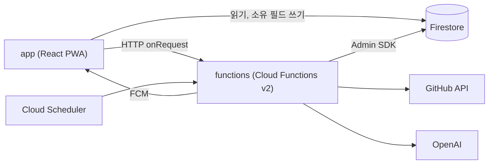

# 구성

| 영역 | 경로 | 맡는 일 |
|------|------|------|
| 프론트엔드 | `app` | 랜딩(`/`)과 앱(`/app`)을 별도 HTML 진입점으로 빌드해 Firebase Hosting에 배포 |
| 서버 | `functions` | GitHub 조회, AI 카드 생성과 번역, 질문 재생성, 스케줄 작업. 리전은 `asia-northeast3` |
| 데이터 | `firestore.rules` | 클라이언트 접근 경계. 자세한 내용은 [Firestore 데이터 경계](firestore-data-boundary.md) |

`functions/src/index.ts`가 `setGlobalOptions({maxInstances: 10})`로 함수별 최대 컨테이너 수를 묶어 비용을 제한합니다. Stripe 결제 함수는 아직 export하지 않습니다.

# 스케줄 작업

| 함수 | 주기 | 하는 일 |
|------|------|------|
| `sendDaily8amPush` | 매시 정각 | 사용자 타임존의 현재 시가 `preferredPushHour`(기본 8)와 같은 사용자에게 FCM 발송. 알림 클릭 시 `/app`을 연다 |
| `scheduleFlashcardPregeneration` | 매시 정각 | 로컬 0시부터 6시 사이 사용자의 오늘 덱 생성 태스크 등록. [오늘의 플래시카드 사전 생성](../flashcard/pregeneration.md) |
| `refreshTrendingRepos` | 매일 09시 KST | GitHub Trending 10곳 수집, 랜딩 데모 카드 사전 생성 |
| `cleanupDeletedUsers` | 매일 12시 KST | 오늘 이전의 탈퇴 기록 삭제. 탈퇴 당일만 재가입을 막음 |

매시 정각 작업이 전 타임존을 하루 24회로 덮는 방식이라, 사용자별 시각 판정은 각 함수가 타임존을 직접 계산합니다.
