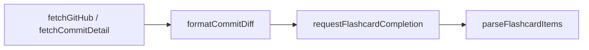

# 세 경로

| 경로 | 진입점 | 실행 시점 | 저장 위치 |
|------|------|------|------|
| 실시간 생성 | 앱 `useTodayFlashcards`가 `openaiChatCompletions` 호출 | 사용자가 앱을 열었는데 오늘 덱이 없을 때 | `users/{uid}/flashcards/{YYYY-MM-DD}` |
| 사용자 사전 생성 | `pregenerateUserFlashcards` | 사용자 타임존 새벽 | 같은 문서 |
| 랜딩 데모 사전 생성 | `refreshTrendingRepos`가 `pregenerateDemoFlashcards` 호출 | 매일 09시 KST | `demoFlashcards` |

세 경로는 실행 시점과 커밋 선택, 저장 위치가 달라 그 부분은 각자 둡니다. GitHub 조회, diff 구성, AI 호출처럼 같아야 하는 단계만 `functions/src/flashcard-generation.ts`에 모았습니다. 따로 두면 모델이나 프롬프트를 바꿀 때 한 경로만 바뀐 채 남기 때문입니다.

# 공용 단계

- `formatCommitDiff`는 앱 `formatCodeDiff`와 같은 마크다운 형식을 만듭니다. 카드 뒷면 Diff 보기와 AI 입력에 함께 씁니다.
- `requestFlashcardCompletion`은 OpenAI Structured Outputs(`FLASHCARD_RESPONSE_SCHEMA`)로 `question`, `answer`, `highlights` 형식을 보장합니다. 이 스키마는 앱 타입과 함께 바꿔야 합니다.
- 추론 강도는 `low`, 출력 상한은 8,192토큰입니다. 실시간 생성은 앱이 응답을 기다리고, 데모 사전 생성은 저장소 10곳을 540초 안에 처리해야 하기 때문입니다.
- GitHub 401은 `GitHubAuthError`로 구분합니다. 토큰 무효는 재시도해도 바뀌지 않아 호출부가 다르게 처리합니다.

# 앱과 서버가 함께 바꿔야 하는 값

app과 functions는 따로 빌드되는 패키지라 코드를 공유하지 못합니다. 아래 값은 양쪽에 복사되어 있어 한쪽만 바꾸면 어긋납니다.

| 값 | 앱 | 서버 |
|------|------|------|
| 등급별 복습 간격 (Free 1, 7일 전 / Pro 1, 7, 30일 전) | `useTodayFlashcards.ts` | `flashcard-pregeneration.ts` |
| 덱 크기 예산 | `features/flashcard/lib/deck-size.ts` | `flashcard-deck-size.ts`. [덱 문서 크기 예산](deck-size-budget.md) |
| 카드 응답 스키마 | 앱 types | `FLASHCARD_RESPONSE_SCHEMA` |
