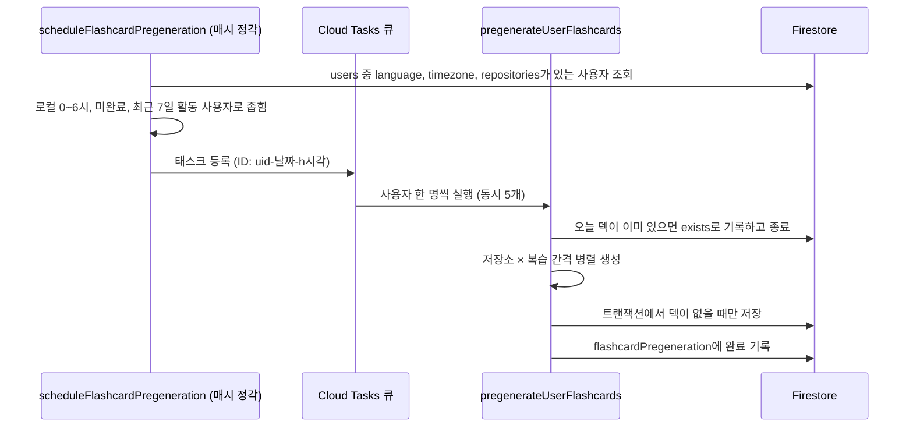

# 왜 만들었나

앱을 켤 때 브라우저가 저장소와 날짜마다 GitHub 조회와 AI 생성을 순차로 기다려 첫 화면이 느렸습니다. 사용자 타임존의 자정이 지나면 서버가 그날 덱을 미리 만들어 두고, 앱은 그 문서를 읽기만 합니다. 사전 생성이 없거나 실패하면 앱이 기존처럼 [실시간 생성](generation-paths.md)으로 이어갑니다.

# 흐름

# 설계 판단

| 판단 | 이유 |
|------|------|
| 스케줄러와 태스크 두 단계 | 사용자가 늘어도 스케줄러는 대상 선정만 하고, OpenAI 동시 호출은 큐의 동시 실행 상한(5)으로 조절 |
| 대상을 자정 한 시각이 아닌 0시부터 6시 구간으로 잡음 | 스케줄러가 몇 시각 실패해도 사용자가 일어나기 전에 따라잡게 함 |
| 태스크 ID에 시각을 넣음 | 같은 시각의 재시도는 ID가 겹쳐 중복 등록되지 않고, 다음 시각에는 새 ID로 놓친 사용자를 다시 잡음 |
| 최근 7일 활동 사용자만 대상 | 유휴 계정의 AI 비용을 막음. 활동 시각은 Auth의 토큰 갱신 시각(`lastRefreshTime`)을 씀 |
| `timezone`이나 `language`가 없으면 제외 | 새 앱을 한 번도 열지 않은 사용자라 언어를 추정해 틀린 덱을 만들지 않음 |
| 완료 기록 컬렉션을 따로 둠 | 덱 문서만으로는 "커밋이 없어 카드가 없음"과 "아직 안 만듦"을 구분할 수 없음 |
| 저장을 트랜잭션에서 다시 확인 | 생성 중 사용자가 앱을 열어 앱이 먼저 저장할 수 있음 |

# 완료 사유

| 값 | 뜻 |
|------|------|
| `saved` | 덱을 저장함 |
| `exists` | 앱이 먼저 덱을 만들어 둠 |
| `empty` | 해당 날짜 커밋이 없어 만들 카드가 없음 |
| `unavailable` | GitHub 토큰 무효나 설정 없음처럼 재시도해도 바뀌지 않는 문제 |

일시 오류로 카드를 하나도 못 만들면 완료 기록 없이 예외를 던집니다. 태스크 큐가 최대 3회 재시도하고, 그래도 실패하면 구간 안의 다음 정각에 새 태스크로 다시 시도합니다. 일부 조합만 실패해 덱이 비었을 때도 `empty`로 확정하지 않습니다. 실패한 조합에 커밋이 있었을 수 있기 때문입니다.
